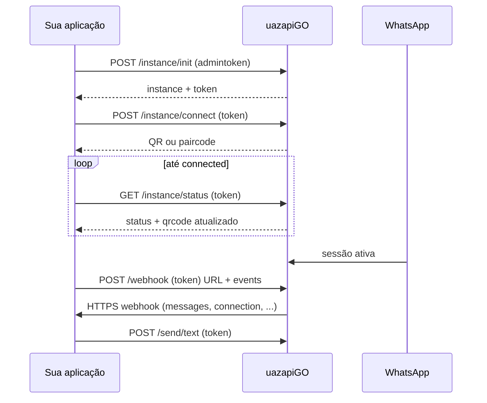

# Integração WhatsApp via uazapiGO (ponta a ponta)

## Fonte canônica

- **OpenAPI**: `docs/integration/uazapi/spec/openapi.yaml` (título *uazapiGO - WhatsApp API v2.0*).
- **Paths**: `docs/integration/uazapi/spec/paths/*.yaml` — cada arquivo descreve um endpoint com exemplos e regras.
- **Schemas**: `docs/integration/uazapi/spec/components/schemas/*.yaml`.
- **Mapa resumido de rotas**: [reference-endpoints.md](reference-endpoints.md).
- **Payloads prontos (JSON + cURL)**: [examples.md](examples.md).

Sempre preferir a spec local ao inventar URLs, headers ou payloads.

## Servidor

- Padrão OpenAPI: `https://{subdomain}.uazapi.com` com `subdomain` em `free` | `api` (instalações podem usar subdomínio dedicado, ex. projeto em produção).
- No Consultas PRO, a base costuma vir de `UAZ_API_BASE_URL` (ver `backend/src/config/env.ts`).

## Autenticação

| Contexto | Header | Onde usar |
|----------|--------|-----------|
| Operações da instância (conectar, enviar, webhook da instância, etc.) | `token: <token da instância>` | Quase todos os paths após criar a instância |
| Admin (criar instância, webhook global, etc.) | `admintoken: <admin token>` | Ex.: `POST /instance/init`, `/globalwebhook` |

`Content-Type: application/json` para bodies JSON.

## Estados da instância

- `disconnected` — sem sessão WhatsApp ativa.
- `connecting` — aguardando QR ou código de pareamento.
- `connected` — autenticado e operacional.

Monitorar com **`GET /instance/status`** (QR/pair podem ser atualizados durante `connecting`).

## Recomendações e limites (spec)

- **WhatsApp Business** é fortemente recomendado vs. conta pessoal (estabilidade).
- **Limite de instâncias conectadas** no servidor; exceder pode retornar **429**.
- Servidores demo/gratuitos podem ter TTL ou restrições (mensagens tipo `info` na criação da instância).
- Endpoints **Business** marcados como experimentais na spec.

## Fluxo ponta a ponta (visão rápida)

## Fluxo ponta a ponta (integração típica)

1. **Obter `admintoken` e `baseUrl`** do painel/provedor uazapi.
2. **Criar instância** — `POST /instance/init` com body `{ "name": "..." }` (opcionais: `systemName`, `adminField01`, `adminField02`, `fingerprintProfile`, `browser`).
   - Resposta inclui **`token` da instância** — persistir com segurança; é a credencial operacional.
3. **Conectar ao WhatsApp** — `POST /instance/connect`.
   - **Sem** `phone` no body → gera **QR** (base64 na instância / status).
   - **Com** `phone` (E.164 digits, ex. `5511999999999`) → **código de pareamento**.
   - Timeouts descritos na spec: ~2 min (QR) / ~5 min (pair).
4. **Poll** — `GET /instance/status` até `connected` (ou tratar falha/timeouts no produto).
5. **Webhook (recomendado antes ou logo após conectar)** — `POST /webhook` com URL pública HTTPS.
6. **Operação** — envio (`/send/*`), leitura (`/message/find`, `/chat/find`), mídia (`/message/download`), etc.

### Sincronização de histórico (spec)

- Na conexão (pós-QR), mensagens sincronizadas da Meta podem chegar no webhook como evento **`history`**.
- Últimos **7 dias** ficam no banco da uazapi e são acessíveis via `POST /message/find` e `POST /chat/find`; limpeza de mensagens mais antigas ocorre na madrugada.

## Webhooks

### Por instância — `GET` / `POST /webhook`

- **GET** retorna **sempre um array** de configurações (mesmo um item).
- **POST** — modo simples (recomendado): não enviar `action` nem `id`; um webhook por instância é criado/atualizado automaticamente.

**Eventos** (lista da spec): `connection`, `history`, `messages`, `messages_update`, `call`, `contacts`, `presence`, `groups`, `labels`, `chats`, `chat_labels`, `blocks`, `leads`, `sender`.

**Filtros `excludeMessages`**: `wasSentByApi`, `wasNotSentByApi`, `fromMeYes`, `fromMeNo`, `isGroupYes`, `isGroupNo`.

**Anti-loop (obrigatório em automações que enviam pela API)**:

- Incluir `"excludeMessages": ["wasSentByApi"]` no webhook, **ou**
- Garantir deduplicação por `wasSentByApi` / IDs no consumidor.
- No Consultas PRO, quando o webhook `messages` chegar com **`fromMe=true` + `wasSentByApi=true`**, tratar o evento como **eco tecnico de entrega**: **registrar auditoria/log** e **nao** criar nova mensagem conversacional exibivel no `/chat`.
- A bolha visível “enviada por mim” deve ser a mensagem já criada pela origem funcional do envio:
  - envio pela UI `/chat` -> `source='chat'`
  - resposta do agente/n8n -> `source='n8n_ai'`
- Se a UAZAPI devolver `messageid`/`id` no `POST /send/text`, preferir atualizar silenciosamente a mensagem original com esse identificador em vez de esperar o eco para criar outra linha.

**URLs dinâmicas**: `addUrlEvents` e `addUrlTypesMessages` acrescentam segmentos ao path da URL configurada (evento e/ou tipo de mensagem).

### Webhook global — `/globalwebhook`

- Requer **`admintoken`**.
- Recebe eventos de **todas** as instâncias; mesmo cuidado com **`wasSentByApi`** em escala multi-instância.

### Payload (schema `WebhookEvent`)

Campos de alto nível: `event`, `instance`, `data` (objeto flexível — formato varia por tipo de evento). Tratar `data` como **semi-estruturado** e validar no backend.

### Testes de URL

A spec recomenda **webhook.cool** e **rbaskets.in**; desaconselha **webhook.site** por rate limit agressivo.

## SSE (alternativa ao webhook)

- `GET /sse` — conexão persistente; autenticação e query string conforme `paths/sse.yaml` (exemplo na spec com `token` e `events` na query).
- Útil quando não há URL pública estável; exige cliente mantendo conexão aberta.

## Enviar mensagens

### Texto — `POST /send/text`

Body mínimo: `number`, `text`.

- **`number`**: telefone internacional, JID de grupo (`...@g.us`), ou usuário (`...@s.whatsapp.net` / `@lid` conforme spec).
- **Campos opcionais comuns** (documentados na tag *Enviar Mensagem* do OpenAPI): `delay`, `readchat`, `readmessages`, `replyid`, `mentions`, `forward`, `track_source`, `track_id`, `async`.
- **`async: true`**: 200 significa aceito na fila; falhas reais podem exigir inspeção via `/message/find` com filtro de status falho.
- **Placeholders** no texto: `{{name}}`, `{{wa_name}}`, campos de lead, `{{lead_field01}}`… — ver seção *Placeholders* no `openapi.yaml`.
- **Preview de link**: `linkPreview`, `linkPreviewTitle`, etc. (ver `send_text.yaml`).

Outros tipos: `/send/media`, `/send/contact`, `/send/location`, menus, carrossel, PIX, pagamento, status — ver paths correspondentes.

## Mídia e busca

- **`POST /message/download`**: `id` da mensagem; opções `return_base64`, `generate_mp3`, `return_link`, `transcribe`, `openai_apikey`, `download_quoted`.
- **`POST /message/find`**: histórico/paginação; respostas podem variar em formato — normalizar como no client do projeto se necessário.

## Chats, contatos, CRM

- **`POST /chat/find`**, **`POST /chat/details`**, **`POST /chat/editLead`** — núcleo do “CRM” embutido na API (leads e campos persistidos lado uazapi).
- Contatos: `/contacts`, `/contacts/list`, `/contact/add`, `/contact/remove`.
- Grupos: `/group/*`; comunidades: `/community/*`.

## Proxy

- Instâncias podem usar proxy interno, `proxy_url` ou app Android (links na tag *Proxy* do OpenAPI). Relevante para latência/região.

## Domínios avançados (somente ponteiros)

Não duplicar a spec aqui; abrir os YAML quando for implementar:

- **Chatbot / IA**: `/instance/updatechatbotsettings`, `/agent/*`, `/trigger/*`, `/knowledge/*`, `/function/*` — exige chaves de provedores de IA e configuração cuidadosa.
- **Disparo em massa (sender)**: `/sender/simple`, `/sender/advanced`, pastas e filas — ver paths `sender_*`.
- **Chatwoot**: `/chatwoot/config` — integração **beta** na spec; testar fora de produção.
- **Respostas rápidas**: `/quickreply/*` — armazenamento para UI própria; não é chatbot automático.
- **Perfil instância**: `POST /profile/name`, `/profile/image`.
- **Chamadas VoIP**: `/call/make`, `/call/reject`.

## Integração no repositório Consultas PRO

Ao alterar comportamento de WhatsApp neste monorepo:

1. **Cliente HTTP**: `backend/src/infra/integrations/uazapi.client.ts` — headers `token` / `admintoken`, `fetch`, timeouts, tratamento de erro.
2. **Domínio chat**: `backend/src/modules/chat/chat.service.ts`, `chat.controller.ts`, `chat.repository.ts`, `chat-webhook.service.ts`, rotas em `chat.routes.ts`.
3. **Persistência**: tabela `chat.instances` guarda `uazapi_token`, `uazapi_base_url`, etc.
4. **Variáveis**: `UAZ_API_BASE_URL`, `UAZ_API_ADMIN_TOKEN` (e demais definidas em `env.ts`).
5. **Mídia**: doc adicional `docs/integration/uazapi/uazapi-media-handing.md` se aplicável.

Regras de arquitetura: seguir **consultas-pro-backend-canonical** — sem SQL nem `fetch` direto na rota; estender `uazapiClient` ou service.

### Regra conversacional do `/chat`

- **Mensagem exibível**: inbound do contato (`fromMe=false`), envio iniciado pela UI, ou resposta funcional do agente/n8n.
- **Evento só de auditoria**: webhook de eco `fromMe=true` disparado após envio pela API.
- **Não misturar log com thread**: tabelas/consultas de conversa não devem usar o eco como nova bolha nem como nova última mensagem do contato.

## Códigos HTTP frequentes

| Código | Significado típico |
|--------|---------------------|
| 200 | Sucesso |
| 400 | Payload inválido |
| 401 | `token` / `admintoken` inválido ou ausente |
| 404 | Instância ou recurso não encontrado |
| 429 | Rate limit ou limite de conexões |
| 500 | Erro interno uazapi |

Mapear para erros de aplicação sem vazar tokens em logs.

## Checklist de implementação

- [ ] Guardar `baseUrl` + `instance token` por tenant/conta.
- [ ] Fluxo UX para QR ou pair + polling de `/instance/status`.
- [ ] Webhook HTTPS com verificação de origem (segredo, IP allowlist, ou ambos, conforme risco).
- [ ] `excludeMessages: ["wasSentByApi"]` ou lógica equivalente.
- [ ] Idempotência no processamento de webhook (mesmo evento pode repetir).
- [ ] Timeout e retry com backoff em chamadas à API.
- [ ] Tratamento de 429 (fila ou mensagem ao usuário).

## Documentação externa

- `info.externalDocs.url` na spec: https://docs.uazapi.com/

## Quando aprofundar

- Detalhe de **cada rota**: arquivo em `docs/integration/uazapi/spec/paths/<operation>.yaml`.
- **Lista completa de paths**: [reference-endpoints.md](reference-endpoints.md).
- **Exemplos copiáveis** (init, connect, webhook, send, find, download): [examples.md](examples.md).
