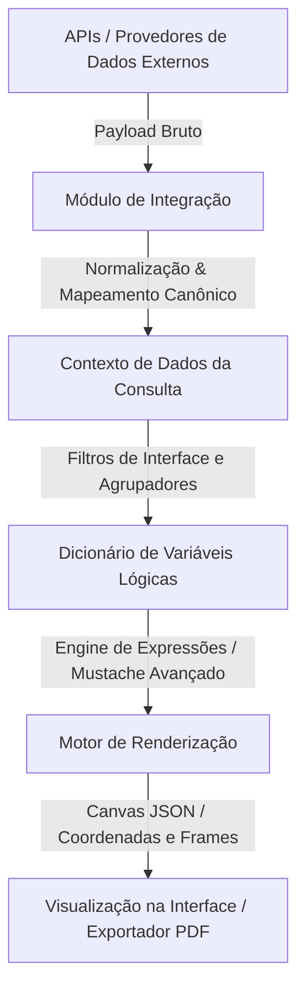

# 🎨 Playbook Técnico: Engenharia de Layouts e Motor de Renderização de Canvas Dinâmico

Este documento define os padrões conceituais de arquitetura, mapeamentos estruturais, engenharia de renderização de expressões lógicas e o processo avançado de conversão de mockups estáticos para o motor de **Canvas Dinâmico** do sistema. Ele serve como instrução definitiva para desenvolvedores e agentes autônomos operarem com máxima fidelidade e previsibilidade matemática no processamento de layouts.

---

## 🏛️ 1. Arquitetura Geral do Motor de Apresentação

O sistema utiliza um paradigma de exibição baseado em um **Canvas Dinâmico Multicamadas** parametrizado via JSON. Diferente de fluxos HTML/CSS tradicionais que estão sujeitos a quebras dinâmicas de renderização de acordo com o tamanho do conteúdo e comportamento do navegador, este motor utiliza um sistema de posicionamento absoluto em coordenadas físicas `(x, y, width, height)` e paginação estruturada em **Frames Lógicos** estanques.

Este design garante que o layout final gerado em tela seja reproduzido de maneira idêntica na exportação física para formatos de documento estáticos (como PDF ou impressão).



---

## 💾 2. Modelagem Arquitetural de Dados (Esquema de Banco)

O acoplamento entre os dados brutos e os templates de exibição baseia-se em relacionamentos estruturados no banco de dados para garantir reusabilidade e idempotência:

### 2.1. O Modelo de Template (`Template`)
Armazena a folha de desenho virtual (canvas), as configurações do grid de design e todo o conteúdo do layout.
* **`id`**: Identificador único do template (em formato `cuid` ou chave única do sistema).
* **`layout`**: Objeto do tipo `Json` contendo a especificação das páginas físicas (`frames`) e a coleção de objetos individuais (`elements`).
* **`logo`**: Metadados ou binários de identidade visual padrão para cabeçalho do documento.

### 2.2. O Modelo de Associação de Contexto (`TemplateItem`)
Realiza a ponte lógica entre o layout abstrato do template e as fontes de dados físicas (produtos de integração) que o alimentam.
* **`alias`**: Namespace lógico definido na associação (ex: `DadosBasicos`, `HistoricoFinanceiro`, `AnaliseRisco`). As variáveis dinâmicas no template são interpretadas sob este escopo (ex: `{{DadosBasicos.nome_completo}}` ou `{{AnaliseRisco.pontuacao_score}}`).
* **`sortOrder`**: Ordem de prioridade na injeção de dados.

### 2.3. O Modelo de Produto de Integração (`ProviderProduct`)
Controla o comportamento de requisição e regras de filtragem.
* **`bodyTemplate`**: Payload de requisição (JSON ou outro formato estruturado) enviado ao provedor de dados, contendo tags parametrizadas.
* **`typeItemFilters`**: Objeto JSON com regras de filtro de dados, mapeando como o payload de resposta bruto deve ser transformado para alimentar as tabelas e variáveis lógicas.

---

## 📐 3. Estrutura do Layout Canvas JSON

O campo `layout` do modelo de template segue rigidamente a especificação esquemática abaixo:

```json
{
  "id": "template_identificador_unico",
  "name": "Nome de Referência do Layout",
  "canvas": {
    "grid": 10,
    "background": "#f1f5f9"
  },
  "frames": [
    {
      "id": "frame_pagina_1",
      "name": "Página 1 (Título Lógico)",
      "x": 0,
      "y": 0,
      "width": 794,
      "height": 1123,
      "preset": "a4-p",
      "background": "#ffffff",
      "customHtml": null
    }
  ],
  "version": 3,
  "elements": [
    {
      "id": "el_identidade_visual",
      "frameId": "frame_pagina_1",
      "type": "image",
      "x": 40,
      "y": 30,
      "width": 150,
      "height": 50,
      "zIndex": 1,
      "data": {
        "src": "{{logo_contexto_dados}}",
        "fit": "contain"
      },
      "style": {}
    }
  ]
}
```

### 3.1. Primitivos de Elementos Disponíveis no Canvas
1. **`text`**: Exibe textos simples ou blocos de **HTML Rico** (quando o valor é prefixado com `html:<div...`). Suporta interpolações complexas e tags do interpretador.
2. **`image`**: Renderiza imagens estáticas ou dinâmicas via URL ou strings no formato Base64.
3. **`icon`**: Renderiza elementos gráficos vetoriais de uma biblioteca canônica de ícones (ex: `User`, `TrendingUp`, `Activity`, `FileText`).
4. **`divider`**: Elementos de separação visual horizontal ou vertical para delimitação de seções.
5. **`container`**: Caixas estruturais de agrupamento (cards) com suporte a estilização de bordas, cores e sombras de fundo. Servem para criar layouts base de cartões ricos com elementos sobrepostos.
6. **`table`**: Tabelas dinâmicas que iteram de forma automatizada sobre matrizes/arrays de dados injetados (como históricos de transações ou registros de apontamentos).

---

## 🧠 4. Interpretador Lógico e Sintaxe de Expressões Complexas

O backend da plataforma executa uma rotina de renderização (`renderTemplateObject`) que interpreta expressões lógicas e fórmulas avançadas em tempo de compilação do layout.

### 4.1. Sintaxe de Expressões com Escopo e Condicionais Estruturadas
Para permitir a tomada de decisões dinâmicas diretamente na camada de visualização (evitando a necessidade de criar regras complexas no backend para cada variação de estilo), o motor suporta a atribuição de variáveis locais e estruturas condicionais equivalentes a `case when`:

* **Atribuição de Variáveis**: `VAR nome_variavel = valor` (define uma variável no escopo local da expressão).
* **Condicionais Complexas**: `case when expressao_1 then valor_1 when expressao_2 then valor_2 else valor_padrao end`.
* **Retorno de Expressão**: `RETURN nome_variavel_ou_valor` (declaração final do valor a ser injetado no campo).

#### Exemplo Teórico (Bandeamento de Cores Dinâmico):
```handlebars
{{VAR pontuacao = $DADOS_PONTUACAO[0].valor_score VAR cor = case when pontuacao <= 250 then "#ef4444" when pontuacao <= 500 then "#f97316" when pontuacao <= 750 then "#eab308" else "#22c55e" end RETURN cor}}
```

#### Exemplo de Velocímetro SVG com Rotação Matemática Dinâmica:
Para renderizar velocímetros vetoriais de alta fidelidade visual, a agulha de rotação é calculada via equações matemáticas com base na pontuação normalizada:
* Semicírculo padrão: amplitude de **180 graus** (começando em **-90 graus** na extrema esquerda e terminando em **+90 graus** na extrema direita).
* Equação de mapeamento linear de um valor $V$ de 0 a 1000 para graus de rotação ($\theta$):
$$\theta = (V \times 0.18) - 90$$

No SVG, isso se traduz no seguinte elemento rotativo:
```svg
<line x1="100" y1="92" x2="100" y2="36" stroke="#334155" stroke-width="4" stroke-linecap="round" transform="rotate({{calc($DADOS_PONTUACAO.score * 0.18 - 90)}} 100 92)"/>
```
*(Onde `100 92` representam as coordenadas centrais `cx cy` de ancoragem da agulha de medição).*

---

## 🔄 5. Engenharia Reversa e Conversão de Mockups (Imagem/PDF ➔ Canvas JSON)

A conversão automática ou manual de mockups visuais estáticos para a estrutura de dados em coordenadas do Canvas Dinâmico segue um fluxo de trabalho estruturado para garantir fidelidade de pixels:

1. **Análise de Resolução Física**: A proporção de uma folha no padrão **A4 Retrato** sob resolução de 96 DPI é de exatamente `794px` (largura) por `1123px` (altura).
2. **Definição de Margem de Segurança**: Elementos interativos e blocos de conteúdo devem manter um distanciamento mínimo de `40px` em relação às bordas laterais do frame para evitar cortes físicos na impressão.
3. **Mapeamento de Cores e Tipografia**: Identificar a paleta de cores predominantes e convertê-las para valores harmoniosos (HSL ou Hexadecimal) compatíveis com a identidade estética pré-estabelecida no motor CSS.
4. **Agrupamento de Contêineres (Bounding Boxes)**:
   - Identificar blocos lógicos de informações correlatas (ex: cartões de resumo ou seções cadastrais).
   - Desenhar um elemento `type: "container"` servindo de background estrutural.
   - Posicionar os elementos filhos de texto, ícones ou tabelas no plano superior, controlando a hierarquia de renderização através do `zIndex`.

---

## 🛠️ 6. Engenharia de Integração e Corpos de Requisição

Ao configurar novos endpoints de APIs externas ou ajustar integrações existentes no banco de dados:

### 6.1. Variáveis Dinâmicas Globais de Controle
O motor injeta metadados padronizados no contexto de resolução dos templates de forma transparente:
* **`{{document}}`**: Documento alvo limpo (apenas algarismos numéricos).
* **`{{documento}}`**: Sinônimo para retrocompatibilidade.
* **`{{is_cpf}}`**: Booleano reativo que avalia se o documento possui tamanho correspondente a uma pessoa física.
* **`{{is_cnpj}}`**: Booleano reativo que avalia se o documento possui tamanho correspondente a uma pessoa jurídica.

### 6.2. Regra de Preservação Estrita de Payloads (`bodyTemplate`)
O corpo da requisição registrado em `bodyTemplate` deve manter **toda a estrutura estática original exigida pelo provedor externo de dados**, limitando-se a substituir cirurgicamente as variáveis dinâmicas de parâmetros para garantir que chaves de autenticação e credenciais não sejam corrompidas.

* ❌ **Inadequado** (Simplificação estrutural drástica):
  ```json
  { "document": "{{document}}" } // Descarta dados de contexto obrigatórios do endpoint!
  ```
*  **Recomendado** (Preservação estrita da estrutura da API com interpolação precisa):
  ```json
  {
    "RequestHeader": {
      "ClientCode": "CHAVE_AUTENTICACAO_ESTATICA"
    },
    "Parameters": {
      "TargetIdentifier": "{{document}}",
      "ScopeType": "A"
    },
    "ApiVersion": "1.0.0"
  }
  ```

---

## 📚 7. Documentos Complementares e Direcionamentos de Leitura

Para aprofundar-se em aspectos de implementação prática, consulte as seguintes folhas de especificação técnica e guias de suporte disponíveis:

1. 📐 **[multipages-a4-layout-pattern.md](file:///consultas-pro-app/docs/skills/template-management/multipages-a4-layout-pattern.md)**: Detalha o padrão de encapsulamento geométrico para relatórios multipáginas baseados em injeção de HTML/CSS em frames físicos estanques A4.
2. 📊 **[context-data-mappings.md](file:///consultas-pro-app/docs/skills/template-management/context-data-mappings.md)**: Catálogo de referência prática contendo o mapeamento de variáveis dinâmicas reais de um produto financeiro corporativo complexo.
3. 📖 **[GUIA_CRIACAO_TEMPLATES.md](file:///consultas-pro-app/docs/skills/template-management/GUIA_CRIACAO_TEMPLATES.md)**: Manual operacional focado no fluxo de trabalho passo a passo para sementes (seed), replicação e validação prática de layouts no banco de dados.

