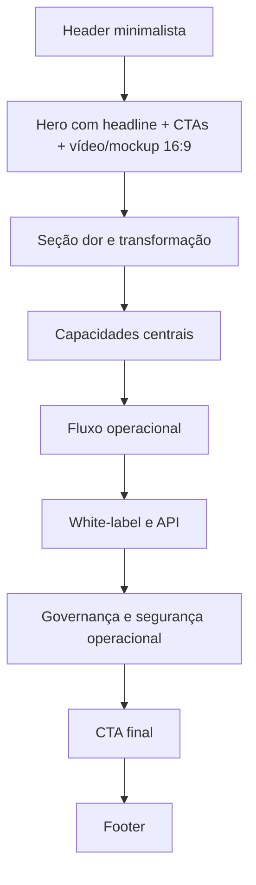

# Landing page institucional para Consultas PRO

## Resumo executivo

Conectores habilitados informados no ambiente do usuário: **google_drive**. Nesta sessão, porém, o Google Drive não ficou exposto para leitura operacional no namespace disponível do `api_tool`; por isso, a análise factual do sistema foi feita diretamente sobre os arquivos enviados na conversa: `backend.zip`, `frontend.zip`, `docs.zip`, `compozy.zip` e `Video-Consultas-PRO.md`. Essa limitação afeta apenas o método de acesso às fontes internas, não a leitura do código e da documentação local.

A leitura combinada de `docs`, `backend` e `frontend` mostra que o **Consultas PRO** não é apenas um painel para “rodar consultas”. Ele se posiciona melhor como uma **plataforma B2B e B2B2C para emissão de consultas, composição de relatórios personalizados, operação white-label e distribuição via API/widget**, com controle de saldo, governança por empresa, gestão de equipe, catálogo de integrações, mapeamento de campos, merge de payloads, deduplicação e um editor visual avançado para relatórios. O maior valor comercial está em **transformar integrações complexas com bureaus e provedores em uma experiência de produto vendável, personalizável e operacionalmente controlada**.

A melhor landing institucional para esse produto não deveria parecer “mais um site de consultas”. Ela precisa comunicar quatro pilares, em linguagem corporativa e tecnológica: **orquestração**, **personalização**, **white-label** e **governança operacional**. O tom mais adequado, olhando a referência do Compozy e o próprio frontend do projeto, é **minimalista, escuro, técnico, com microcopy enxuto, bordas finas, grid discreto, badges monoespaçados e acentos visuais com energia controlada**. O site de referência explora uma estética dark tech com foco em hierarquia forte, cartões encaixados, labels técnicas e metadados sociais consolidados; para a sua landing, a inspiração deve ser adaptada para um contexto mais institucional e confiável, não para um visual puramente “developer tool”. citeturn4view2turn5view5turn5view6

Também há um ponto importante de maturidade: o **núcleo do produto** está bem desenhado e com sinais claros de robustez arquitetural, mas a **camada de apresentação ainda mistura áreas já integradas com outras ainda abastecidas por mocks**. Isso significa que a landing deve vender com ênfase o que o sistema já prova muito bem — plataforma, white-label, integrações, relatórios, controles e editor — enquanto evita promessas excessivamente específicas sobre telas operacionais que ainda dependem de acoplamento final ou validação adicional em produção.

## Leitura do sistema e posicionamento do produto

Pelo conjunto de documentos e do código, o público-alvo principal do Consultas PRO é formado por **empresas que consomem, operam ou revendem consultas de crédito, restrições e dados de apoio à decisão**, incluindo estruturas com usuários internos, gestores, operação multiempresa e parceiros externos. O sistema também aponta para um uso **embedded/white-label**, no qual o cliente final da sua empresa pode consumir a experiência por widget ou API, sem sair da marca do parceiro. Isso aparece com força tanto na arquitetura multi-tenant e no modelo de carteiras/saldo quanto na presença de tokens, `allowedOrigins`, `externalUserId`, widget público e personalização visual do embed.

A proposta de valor mais forte pode ser sintetizada assim: **“Centralize provedores, componha consultas sob medida, gere relatórios personalizados e distribua tudo com sua marca, API e governança financeira.”** Em vez de vender apenas “busca em SPC/Serasa”, a landing deve vender **controle da operação**. No código, isso aparece em três frentes muito claras: emissão de consulta com validação de saldo e filas assíncronas; catálogo administrativo de provedores, produtos, mappings e testes; e camada de template/report com merge, tipagem de campos e edição visual avançada.

A tabela abaixo resume o que mais vale transformar em discurso comercial.

| Capacidade observada no sistema | Benefício percebido pelo cliente | Como isso deve aparecer na landing |
|---|---|---|
| Consulta por template ou por seleção direta de produtos | Montagem flexível por caso de uso | “Monte consultas sob medida para cada jornada” |
| Wallet, ledger e débito por emissão | Controle financeiro e previsibilidade operacional | “Controle saldo, consumo e repasses com rastreabilidade” |
| Worker assíncrono com status `QUEUED`, `PROCESSING`, `COMPLETED`, `PARTIAL`, `FAILED` | Escalabilidade e resiliência da operação | “Emissões processadas com fila, retry e status auditável” |
| Merge de payloads e normalização entre provedores | Relatórios mais consistentes, mesmo com múltiplas fontes | “Unifique dados de provedores diferentes em um único resultado útil” |
| Widget white-label + token + restrição por domínio/origem | Distribuição com marca própria e segurança | “Entregue a experiência no seu portal, app ou parceiro” |
| `externalUserId` para consumo por usuário do parceiro | B2B2C com rastreamento fino de uso | “Acompanhe consumo até o usuário final do seu ecossistema” |
| Editor de templates/relatórios com fórmula, HTML, preview e componentes reutilizáveis | Personalização comercialmente diferenciadora | “Crie relatórios entregáveis, não apenas consultas cruas” |
| Gestão de usuários, empresas, convites, políticas e tokens | Governança e escala multiempresa | “Administre sua operação sem depender de ajustes manuais” |

### O que o sistema sugere sobre o posicionamento ideal

A documentação arquitetural e o backend sugerem um ciclo de vida consistente: autenticação, emissão, enfileiramento, chamadas a provedores, normalização, merge e renderização do resultado. O frontend, por sua vez, demonstra que o produto foi pensado para operar em duas camadas ao mesmo tempo: uma camada de **operação interna** e outra de **entrega comercial**. Isso é exatamente o tipo de sistema que deveria ser apresentado como **plataforma de infraestrutura de consultas e relatórios**, e não simplesmente como “site de consulta”.

Há também um insight importante para a mensagem principal da landing: o produto parece mais forte quando fala com três perfis ao mesmo tempo:

- **gestão**: quer governança, saldo, usuários, histórico e visibilidade;
- **operação**: quer rapidez para montar consultas e entregar relatórios úteis;
- **parceiros**: querem widget, API, domínio próprio, marca e medição de consumo.

### Fluxos de usuário que merecem virar seção de site

Os fluxos mais claros no sistema são:

1. **Cadastro e entrada**: conta individual ou empresa, login, convites e papéis.
2. **Nova consulta**: escolha do tipo de documento, template ou produtos, emissão e acompanhamento.
3. **Operação por templates**: seleção de blocos, modelagem de relatório e reutilização.
4. **Administração**: usuários, empresas, provedores, produtos, mappings, logs e tokens.
5. **White-label**: criação de token, restrição de origem, embed via `widget.js`, personalização visual e rastreamento via `externalUserId`.

Esses fluxos não devem ser mostrados como “manual do sistema”, mas convertidos em narrativa de valor na landing: **configurar**, **emitir**, **entregar**, **escalar**.

### Limitações conhecidas e avisos de produção

Aqui vale ser direto, porque isso ajuda a escrever uma landing mais honesta e mais forte.

O frontend ainda exibe sinais claros de áreas em maturação. `DashboardPage`, `HistoryPage`, `FinancialPage`, `TeamPage` e `TemplatesPage` consomem dados mockados a partir de `consultationStore.ts`, o que indica que a vitrine operacional dessas áreas ainda pede wiring completo com API antes de virarem prova pública central. A landing, portanto, deve evitar linguagem como “dashboard financeiro em tempo real” se isso ainda não estiver homologado ponta a ponta.

A documentação do **Templates Drawer** registra problemas reais em investigação, como campos fantasmas, divergência entre chaves tipadas e JSON bruto, conflitos de fonte de verdade entre cenários de teste e edição em tempo real, além de comportamento de deduplicação que exigiu análise específica. Isso não enfraquece o produto; ao contrário, mostra profundidade funcional. Mas orienta a comunicação: venda o editor como um **diferencial avançado de modelagem e composição**, não como um módulo “simples e pronto para qualquer caso sem parametrização”.

Do ponto de vista de produção, o backend deixa claros alguns requisitos e alertas: uso de **PostgreSQL**, **Redis**, **worker assíncrono**, segredos ainda exemplificados com placeholder no `.env.example`, e rotas internas/dev que precisam de governança adequada em ambientes públicos. Também há um catálogo de endpoints externos ainda relativamente enxuto, com ênfase principal nas rotas de consultas; isso sugere que as promessas de integração pública devem ser apresentadas com foco em **consultas, widget e tokens**, sem inflar o escopo da API aberta antes de validação comercial.

Por fim, a camada de busca e SEO da landing deve ser tratada com cuidado porque o Google destaca especificamente temas como **mobile-first indexing, metatags, sitemaps, SEO em JavaScript, experiência na página, Core Web Vitals e dados estruturados** como fundamentos de visibilidade e qualidade. citeturn4view0turn6view0turn6view1turn6view2turn6view3turn6view4

## Estrutura da landing e direção visual

A melhor estrutura editorial para a landing, alinhada ao estilo do Compozy e ao que o sistema realmente oferece, é a seguinte:

| Seção | Objetivo | Conteúdo recomendado | CTA |
|---|---|---|---|
| Hero | Posicionar o produto em 5 segundos | headline forte, subtítulo, 3 benefícios, mockup/vídeo | **Solicitar demonstração** |
| Dor e mudança | Mostrar o antes/depois | operação fragmentada vs. plataforma centralizada | **Ver como funciona** |
| Capacidades centrais | Explicar o produto sem excesso | consultas, relatórios, white-label, governança, integrações, equipe | **Explorar módulos** |
| Fluxo operacional | Tornar o produto “entendível” | configurar → emitir → consolidar → entregar | **Agendar apresentação técnica** |
| White-label e API | Destacar diferencial comercial | widget, token, domínio, branding, origem autorizada | **Quero lançar com minha marca** |
| Prova institucional | Dar segurança | arquitetura, rastreabilidade, logs, fila, saldo e equipes | **Falar com especialista** |
| CTA final | Conversão | oferta de demo e implantação | **Solicitar demonstração** |

### Tom de voz recomendado

O tom ideal é **confiante, enxuto e técnico sem ser árido**. A referência do Compozy funciona porque evita excesso de marketing genérico e trabalha com frases curtas, labels pequenos e visual de produto. Para o Consultas PRO, eu adaptaria isso assim:

- menos “revolucione sua empresa”;
- mais “centralize provedores, personalize relatórios e distribua com sua marca”;
- menos neon de laboratório;
- mais sofisticação dark com tecnologia confiável.

### Paleta de cores e tipografia

A paleta abaixo mantém a energia dark-tech da referência, mas com leitura mais corporativa para um sistema financeiro/operacional:

| Uso | Cor |
|---|---|
| Fundo principal | `#05070B` |
| Fundo secundário | `#0C111B` |
| Superfície | `#101826` |
| Linha/borda | `#1E293B` |
| Texto principal | `#F8FAFC` |
| Texto de apoio | `#98A2B3` |
| Primária | `#3B82F6` |
| Primária hover | `#60A5FA` |
| Acento signal | `#B7F171` |
| Sucesso | `#22C55E` |
| Alerta sutil | `#F59E0B` |

Tipografia sugerida em Google Fonts:

| Papel | Fonte |
|---|---|
| Headings | `Space Grotesk` |
| Corpo/UI | `Inter` |
| Labels técnicas / badges | `JetBrains Mono` |

### Sugestões visuais e de assets

As imagens e ilustrações mais úteis para essa landing não são stock photos de pessoas de terno. O site deve parecer produto, não banco de imagens. O ideal é trabalhar com:

| Asset | Função |
|---|---|
| Mockup escuro do dashboard/consulta | Hero e prova de produto |
| Mockup do widget em site parceiro | Seção white-label |
| Diagrama de fluxo de dados | Seção “como funciona” |
| Cards de módulos com ícones lineares | Seção de capacidades |
| Frame de relatório personalizado | Seção de templates/entrega |
| Thumbnail/poster do vídeo institucional | Hero 16:9 |
| OG image 1200×630 | Compartilhamento social |
| Logo SVG dark/light + favicon | Identidade |

Como inferência prática de boas diretrizes de compartilhamento, a página deve sair com `og:title`, `og:type`, `og:image` e `og:url`, que o protocolo Open Graph considera propriedades básicas exigidas para transformar a página em um objeto social compartilhável. citeturn5view5turn5view6

Além disso, as metadescrições devem ser **únicas, descritivas, relevantes à página e não escritas como lista de palavras-chave**, porque o Google usa conteúdo da página e meta descriptions para formar snippets e recomenda descrições claras e específicas por URL. citeturn5view3

## Arquivo HTML responsivo

A estrutura abaixo foi pensada para entregar uma landing estática com **hero 16:9, seções institucionais, footer, placeholders para imagens/ícones e microcopy pronta em pt-BR**. Ela também privilegia HTML semântico, hierarquia clara e uma base adequada para SEO, metatags, compartilhamento social e performance. O Google enfatiza metadados, sitemaps, SEO em JavaScript e experiência na página como fundamentos práticos de publicação; por isso, a versão abaixo assume uma base estática e fácil de rastrear. citeturn4view0turn6view2turn6view3turn6view4

```html
<!DOCTYPE html>
<html lang="pt-BR">
<head>
  <meta charset="UTF-8" />
  <meta name="viewport" content="width=device-width, initial-scale=1.0" />

  <title>Consultas PRO | Plataforma de consultas, relatórios e white-label</title>
  <meta
    name="description"
    content="Centralize provedores, monte consultas sob medida, gere relatórios personalizados e distribua a experiência com sua marca, API e widget white-label."
  />

  <meta property="og:title" content="Consultas PRO | Plataforma de consultas, relatórios e white-label" />
  <meta property="og:description" content="Uma plataforma para operar consultas, relatórios personalizados, integrações e distribuição white-label com governança operacional." />
  <meta property="og:type" content="website" />
  <meta property="og:url" content="https://www.seudominio.com.br/" />
  <meta property="og:image" content="https://www.seudominio.com.br/og-consultas-pro.jpg" />

  <meta name="twitter:card" content="summary_large_image" />
  <meta name="theme-color" content="#05070B" />

  <link rel="preconnect" href="https://fonts.googleapis.com" />
  <link rel="preconnect" href="https://fonts.gstatic.com" crossorigin />
  <link
    href="https://fonts.googleapis.com/css2?family=Inter:wght@400;500;600;700;800&family=JetBrains+Mono:wght@400;500;700&family=Space+Grotesk:wght@500;700&display=swap"
    rel="stylesheet"
  />

  <style>
    :root {
      --bg: #05070B;
      --bg-soft: #0C111B;
      --surface: #101826;
      --surface-2: #0E1522;
      --line: #1E293B;
      --text: #F8FAFC;
      --muted: #98A2B3;
      --primary: #3B82F6;
      --primary-hover: #60A5FA;
      --signal: #B7F171;
      --success: #22C55E;
      --warning: #F59E0B;
      --radius: 22px;
      --container: 1200px;
      --shadow-lg: 0 24px 80px rgba(0, 0, 0, 0.35);
      --shadow-md: 0 12px 30px rgba(0, 0, 0, 0.28);
    }

    * { box-sizing: border-box; }
    html { scroll-behavior: smooth; }
    body {
      margin: 0;
      font-family: "Inter", system-ui, sans-serif;
      background:
        radial-gradient(circle at top left, rgba(59,130,246,0.12), transparent 28%),
        radial-gradient(circle at top right, rgba(183,241,113,0.08), transparent 22%),
        linear-gradient(180deg, #05070B 0%, #060A10 100%);
      color: var(--text);
    }

    body::before {
      content: "";
      position: fixed;
      inset: 0;
      background-image:
        linear-gradient(rgba(255,255,255,0.03) 1px, transparent 1px),
        linear-gradient(90deg, rgba(255,255,255,0.03) 1px, transparent 1px);
      background-size: 28px 28px;
      opacity: 0.18;
      pointer-events: none;
      z-index: 0;
    }

    img { max-width: 100%; display: block; }
    a { color: inherit; text-decoration: none; }

    .container {
      position: relative;
      z-index: 1;
      width: min(calc(100% - 32px), var(--container));
      margin: 0 auto;
    }

    .eyebrow {
      display: inline-flex;
      align-items: center;
      gap: 10px;
      padding: 8px 12px;
      border: 1px solid rgba(183,241,113,0.22);
      color: var(--signal);
      background: rgba(183,241,113,0.06);
      font: 600 11px/1 "JetBrains Mono", monospace;
      text-transform: uppercase;
      letter-spacing: 0.16em;
    }

    .section-tag {
      margin-bottom: 18px;
      color: var(--muted);
      font: 500 12px/1 "JetBrains Mono", monospace;
      text-transform: uppercase;
      letter-spacing: 0.18em;
    }

    .nav {
      position: sticky;
      top: 0;
      z-index: 12;
      backdrop-filter: blur(14px);
      background: rgba(5, 7, 11, 0.74);
      border-bottom: 1px solid rgba(255,255,255,0.06);
    }

    .nav-inner {
      display: flex;
      align-items: center;
      justify-content: space-between;
      min-height: 76px;
      gap: 18px;
    }

    .brand {
      display: flex;
      align-items: center;
      gap: 14px;
      font-weight: 700;
    }

    .brand-mark {
      width: 40px;
      height: 40px;
      border: 1px solid rgba(255,255,255,0.12);
      border-radius: 12px;
      display: grid;
      place-items: center;
      background: linear-gradient(180deg, rgba(59,130,246,0.18), rgba(59,130,246,0.04));
      box-shadow: inset 0 0 0 1px rgba(255,255,255,0.02);
      font: 700 14px/1 "JetBrains Mono", monospace;
      color: var(--signal);
    }

    .brand-copy small {
      display: block;
      color: var(--muted);
      font: 500 10px/1 "JetBrains Mono", monospace;
      text-transform: uppercase;
      letter-spacing: 0.18em;
      margin-bottom: 6px;
    }

    .brand-copy span {
      display: block;
      font-size: 16px;
      letter-spacing: -0.02em;
    }

    .nav-links {
      display: flex;
      align-items: center;
      gap: 22px;
      color: var(--muted);
      font-size: 14px;
    }

    .nav-cta {
      display: flex;
      align-items: center;
      gap: 12px;
    }

    .btn {
      display: inline-flex;
      align-items: center;
      justify-content: center;
      gap: 10px;
      min-height: 48px;
      padding: 0 18px;
      border-radius: 999px;
      border: 1px solid transparent;
      font-weight: 600;
      transition: .2s ease;
      white-space: nowrap;
    }

    .btn-primary {
      background: linear-gradient(135deg, var(--primary), #2364EA);
      color: white;
      box-shadow: 0 12px 28px rgba(59,130,246,0.22);
    }

    .btn-primary:hover {
      transform: translateY(-1px);
      background: linear-gradient(135deg, var(--primary-hover), var(--primary));
    }

    .btn-secondary {
      border-color: rgba(255,255,255,0.12);
      background: rgba(255,255,255,0.03);
      color: var(--text);
    }

    .btn-secondary:hover {
      border-color: rgba(255,255,255,0.22);
      background: rgba(255,255,255,0.06);
    }

    .hero {
      padding: 74px 0 44px;
    }

    .hero-grid {
      display: grid;
      grid-template-columns: 1.1fr 1fr;
      gap: 32px;
      align-items: center;
    }

    .hero h1 {
      margin: 18px 0 18px;
      font-family: "Space Grotesk", sans-serif;
      font-size: clamp(42px, 6vw, 76px);
      line-height: 0.98;
      letter-spacing: -0.05em;
      max-width: 12ch;
    }

    .hero p.lead {
      margin: 0;
      max-width: 62ch;
      color: #CBD5E1;
      font-size: 18px;
      line-height: 1.7;
    }

    .hero-actions {
      display: flex;
      flex-wrap: wrap;
      gap: 14px;
      margin-top: 28px;
    }

    .hero-points {
      display: flex;
      flex-wrap: wrap;
      gap: 12px;
      margin: 22px 0 0;
      padding: 0;
      list-style: none;
    }

    .hero-points li,
    .chip {
      display: inline-flex;
      align-items: center;
      gap: 8px;
      min-height: 38px;
      padding: 0 12px;
      border: 1px solid rgba(255,255,255,0.09);
      border-radius: 999px;
      color: #DCE6F3;
      background: rgba(255,255,255,0.03);
      font-size: 13px;
    }

    .dot {
      width: 8px;
      height: 8px;
      border-radius: 999px;
      background: var(--signal);
      box-shadow: 0 0 14px rgba(183,241,113,0.6);
      flex: 0 0 auto;
    }

    .hero-media {
      border: 1px solid rgba(255,255,255,0.1);
      border-radius: 28px;
      background: linear-gradient(180deg, rgba(16,24,38,0.95), rgba(10,15,24,0.95));
      box-shadow: var(--shadow-lg);
      overflow: hidden;
    }

    .frame {
      aspect-ratio: 16 / 9;
      display: grid;
      grid-template-rows: auto 1fr;
    }

    .frame-top {
      display: flex;
      justify-content: space-between;
      align-items: center;
      padding: 16px 18px;
      border-bottom: 1px solid rgba(255,255,255,0.08);
      background: rgba(255,255,255,0.02);
    }

    .frame-title {
      font: 600 11px/1 "JetBrains Mono", monospace;
      text-transform: uppercase;
      letter-spacing: 0.16em;
      color: var(--muted);
    }

    .frame-body {
      display: grid;
      grid-template-columns: 1.2fr .95fr;
      gap: 18px;
      padding: 18px;
    }

    .panel,
    .card {
      border: 1px solid rgba(255,255,255,0.09);
      border-radius: 20px;
      background: rgba(255,255,255,0.03);
    }

    .panel {
      padding: 18px;
    }

    .placeholder {
      width: 100%;
      height: 100%;
      min-height: 180px;
      border: 1px dashed rgba(255,255,255,0.14);
      border-radius: 18px;
      display: grid;
      place-items: center;
      text-align: center;
      color: var(--muted);
      padding: 18px;
    }

    .mock-kpis {
      display: grid;
      grid-template-columns: repeat(3, 1fr);
      gap: 10px;
      margin-bottom: 12px;
    }

    .kpi {
      padding: 14px;
      border-radius: 16px;
      background: rgba(255,255,255,0.03);
      border: 1px solid rgba(255,255,255,0.07);
    }

    .kpi strong {
      display: block;
      font-family: "Space Grotesk", sans-serif;
      font-size: 20px;
      margin-bottom: 6px;
    }

    .kpi span {
      color: var(--muted);
      font-size: 12px;
    }

    section.block {
      padding: 108px 0;
    }

    .section-head {
      max-width: 760px;
      margin-bottom: 30px;
    }

    .section-head h2 {
      margin: 0 0 12px;
      font-family: "Space Grotesk", sans-serif;
      font-size: clamp(30px, 4vw, 52px);
      line-height: 1.02;
      letter-spacing: -0.045em;
    }

    .section-head p {
      margin: 0;
      color: #CBD5E1;
      font-size: 17px;
      line-height: 1.72;
    }

    .grid-3,
    .grid-2,
    .feature-grid {
      display: grid;
      gap: 18px;
    }

    .grid-3 { grid-template-columns: repeat(3, 1fr); }
    .grid-2 { grid-template-columns: repeat(2, 1fr); }
    .feature-grid { grid-template-columns: repeat(3, 1fr); }

    .card {
      padding: 22px;
      box-shadow: var(--shadow-md);
    }

    .card h3 {
      margin: 14px 0 10px;
      font-size: 20px;
      letter-spacing: -0.03em;
    }

    .card p,
    .card li {
      color: #C7D2E0;
      line-height: 1.7;
      font-size: 15px;
    }

    .card ul {
      margin: 14px 0 0;
      padding-left: 18px;
    }

    .icon-box {
      width: 48px;
      height: 48px;
      border-radius: 14px;
      border: 1px solid rgba(183,241,113,0.22);
      background: rgba(183,241,113,0.06);
      display: grid;
      place-items: center;
      color: var(--signal);
      font: 700 12px/1 "JetBrains Mono", monospace;
    }

    .split {
      display: grid;
      grid-template-columns: 1fr 1fr;
      gap: 20px;
      align-items: stretch;
    }

    .flow {
      display: grid;
      grid-template-columns: repeat(4, 1fr);
      gap: 16px;
    }

    .step {
      position: relative;
      padding: 20px;
      border-radius: 20px;
      border: 1px solid rgba(255,255,255,0.1);
      background: rgba(255,255,255,0.03);
    }

    .step small {
      display: inline-block;
      margin-bottom: 14px;
      color: var(--signal);
      font: 600 11px/1 "JetBrains Mono", monospace;
      text-transform: uppercase;
      letter-spacing: 0.14em;
    }

    .step h3 {
      margin: 0 0 10px;
      font-size: 18px;
    }

    .note {
      margin-top: 18px;
      padding: 16px 18px;
      border-left: 3px solid rgba(245,158,11,0.7);
      background: rgba(245,158,11,0.08);
      color: #E8DAB7;
      border-radius: 14px;
      font-size: 14px;
      line-height: 1.65;
    }

    .cta-section {
      padding: 96px 0 120px;
    }

    .cta-box {
      padding: 34px;
      border-radius: 28px;
      border: 1px solid rgba(255,255,255,0.1);
      background:
        radial-gradient(circle at top right, rgba(59,130,246,0.18), transparent 28%),
        linear-gradient(180deg, rgba(16,24,38,0.96), rgba(9,14,22,0.96));
      box-shadow: var(--shadow-lg);
    }

    .cta-box h2 {
      margin: 0 0 14px;
      font-family: "Space Grotesk", sans-serif;
      font-size: clamp(30px, 4vw, 54px);
      line-height: 1.02;
      letter-spacing: -0.04em;
      max-width: 12ch;
    }

    .cta-box p {
      margin: 0;
      max-width: 58ch;
      color: #CBD5E1;
      line-height: 1.75;
    }

    footer {
      border-top: 1px solid rgba(255,255,255,0.07);
      background: rgba(255,255,255,0.02);
    }

    .footer-inner {
      display: flex;
      justify-content: space-between;
      gap: 24px;
      padding: 28px 0 36px;
      color: var(--muted);
      font-size: 14px;
    }

    .muted-list {
      margin: 0;
      padding-left: 18px;
      color: var(--muted);
      line-height: 1.7;
    }

    @media (max-width: 1080px) {
      .hero-grid,
      .split,
      .grid-2,
      .feature-grid,
      .grid-3,
      .flow,
      .frame-body {
        grid-template-columns: 1fr;
      }

      .nav-links { display: none; }
    }

    @media (max-width: 720px) {
      .nav-inner { min-height: 68px; }
      .hero { padding-top: 54px; }
      section.block { padding: 84px 0; }
      .cta-section { padding: 84px 0 96px; }
      .hero-actions { flex-direction: column; }
      .btn { width: 100%; }
      .mock-kpis { grid-template-columns: 1fr; }
      .footer-inner { flex-direction: column; }
    }
  </style>
</head>
<body>
  <header class="nav">
    <div class="container nav-inner">
      <a href="#top" class="brand" aria-label="Consultas PRO">
        <div class="brand-mark">CP</div>
        <div class="brand-copy">
          <small>Consultas • Relatórios • White-label</small>
          <span>Consultas PRO</span>
        </div>
      </a>

      <nav class="nav-links" aria-label="Seções principais">
        <a href="#capacidades">Capacidades</a>
        <a href="#fluxo">Fluxo</a>
        <a href="#whitelabel">White-label</a>
        <a href="#governanca">Governança</a>
      </nav>

      <div class="nav-cta">
        <a class="btn btn-secondary" href="#whitelabel">Ver white-label</a>
        <a class="btn btn-primary" href="#cta-final">Solicitar demonstração</a>
      </div>
    </div>
  </header>

  <main id="top">
    <section class="hero">
      <div class="container hero-grid">
        <div>
          <div class="eyebrow">Plataforma de consultas e orquestração operacional</div>

          <h1>Consultas, relatórios e white-label para operações que precisam decidir rápido.</h1>

          <p class="lead">
            Centralize provedores, monte consultas sob medida, gere relatórios personalizados
            e distribua a experiência com sua marca, API e widget — com controle de saldo,
            equipe, consumo e histórico em um único ambiente.
          </p>

          <div class="hero-actions">
            <a class="btn btn-primary" href="#cta-final">Solicitar demonstração</a>
            <a class="btn btn-secondary" href="#fluxo">Conhecer o fluxo da plataforma</a>
          </div>

          <ul class="hero-points" aria-label="Diferenciais principais">
            <li><span class="dot"></span> Consultas por template ou por produto</li>
            <li><span class="dot"></span> Relatórios personalizados</li>
            <li><span class="dot"></span> Widget e API white-label</li>
            <li><span class="dot"></span> Governança multiempresa</li>
          </ul>
        </div>

        <div class="hero-media">
          <div class="frame">
            <div class="frame-top">
              <div class="frame-title">Hero 16:9 • vídeo institucional ou mockup do sistema</div>
              <div class="chip"><span class="dot"></span> operação ativa</div>
            </div>

            <div class="frame-body">
              <div class="panel">
                <div class="mock-kpis">
                  <div class="kpi">
                    <strong>+ provedores</strong>
                    <span>Placeholder para catálogo ativo</span>
                  </div>
                  <div class="kpi">
                    <strong>White-label</strong>
                    <span>Widget, token, domínio e API</span>
                  </div>
                  <div class="kpi">
                    <strong>Relatórios</strong>
                    <span>Modelagem visual e entrega</span>
                  </div>
                </div>

                <div class="placeholder">
                  <div>
                    <strong>[PLACEHOLDER]</strong><br />
                    Mockup do dashboard / vídeo institucional / captura do editor de relatórios
                  </div>
                </div>
              </div>

              <div class="panel">
                <div class="section-tag">Módulos visíveis</div>
                <div class="hero-points" style="margin-top:0">
                  <span class="chip">Consultas</span>
                  <span class="chip">Integrações</span>
                  <span class="chip">Templates</span>
                  <span class="chip">Equipe</span>
                  <span class="chip">Financeiro</span>
                  <span class="chip">API Docs</span>
                </div>

                <div class="note" style="margin-top:18px">
                  Substitua esta área por um vídeo curto com três momentos:
                  emissão, consolidação do relatório e experiência white-label.
                </div>
              </div>
            </div>
          </div>
        </div>
      </div>
    </section>

    <section class="block">
      <div class="container">
        <div class="section-head">
          <div class="section-tag">Por que o Consultas PRO existe</div>
          <h2>Quando a operação depende de múltiplos provedores, planilhas e retrabalho, a consulta vira gargalo.</h2>
          <p>
            O Consultas PRO transforma essa complexidade em uma operação centralizada:
            integra fontes, organiza regras, padroniza resultados, compõe relatórios e
            libera a distribuição por painel, API ou widget.
          </p>
        </div>

        <div class="grid-3">
          <article class="card">
            <div class="icon-box">01</div>
            <h3>Unifica provedores</h3>
            <p>
              Reúna integrações, mappings, testes e produtos de consulta em uma única base operacional.
            </p>
          </article>

          <article class="card">
            <div class="icon-box">02</div>
            <h3>Transforma dado em entrega</h3>
            <p>
              Saia do retorno bruto de API e avance para relatórios personalizados, reutilizáveis e apresentáveis.
            </p>
          </article>

          <article class="card">
            <div class="icon-box">03</div>
            <h3>Escala com sua marca</h3>
            <p>
              Distribua a experiência por widget, API e white-label sem perder governança de usuários, consumo e saldo.
            </p>
          </article>
        </div>
      </div>
    </section>

    <section class="block" id="capacidades">
      <div class="container">
        <div class="section-head">
          <div class="section-tag">Capacidades centrais</div>
          <h2>Uma base única para emitir, consolidar, personalizar e distribuir consultas.</h2>
          <p>
            A landing deve vender o produto como plataforma: menos “consulta avulsa”, mais
            “infraestrutura comercial e operacional para consultas e relatórios”.
          </p>
        </div>

        <div class="feature-grid">
          <article class="card">
            <div class="icon-box">CX</div>
            <h3>Consultas sob medida</h3>
            <p>Monte por template ou por seleção direta de produtos conforme a jornada, o perfil do cliente ou o parceiro.</p>
          </article>

          <article class="card">
            <div class="icon-box">RG</div>
            <h3>Relatórios personalizados</h3>
            <p>Estruture blocos, variáveis, fórmulas e apresentação para gerar materiais mais úteis que um retorno bruto de API.</p>
          </article>

          <article class="card">
            <div class="icon-box">WL</div>
            <h3>White-label e widget</h3>
            <p>Leve a experiência para o portal do parceiro com token, domínio autorizado e opção de herdar o visual da marca.</p>
          </article>

          <article class="card">
            <div class="icon-box">OP</div>
            <h3>Integrações com governança</h3>
            <p>Gerencie provedores, produtos, operações, mappings, testes e logs a partir de um catálogo administrável.</p>
          </article>

          <article class="card">
            <div class="icon-box">FN</div>
            <h3>Controle financeiro</h3>
            <p>Acompanhe saldo, débito por consulta, rastreabilidade de consumo e organização por empresa e usuário.</p>
          </article>

          <article class="card">
            <div class="icon-box">TM</div>
            <h3>Estrutura multiempresa</h3>
            <p>Convites, perfis, políticas de acesso e administração central para escalar com equipe e parceiros.</p>
          </article>
        </div>
      </div>
    </section>

    <section class="block" id="fluxo">
      <div class="container">
        <div class="section-head">
          <div class="section-tag">Fluxo operacional</div>
          <h2>Do pedido à entrega, o produto organiza uma jornada clara.</h2>
          <p>
            Esta seção ajuda o visitante a entender rapidamente que o Consultas PRO
            é um sistema de orquestração completa, não apenas uma tela de consulta.
          </p>
        </div>

        <div class="flow">
          <article class="step">
            <small>Configurar</small>
            <h3>Conecte provedores e regras</h3>
            <p>Cadastre produtos, faça mappings, teste integrações e defina políticas da operação.</p>
          </article>

          <article class="step">
            <small>Emitir</small>
            <h3>Monte a consulta ideal</h3>
            <p>Use templates ou selecione produtos específicos por documento, jornada ou parceiro.</p>
          </article>

          <article class="step">
            <small>Consolidar</small>
            <h3>Unifique e modele o resultado</h3>
            <p>Normalize payloads, aplique merge e organize a informação em formato realmente entregável.</p>
          </article>

          <article class="step">
            <small>Distribuir</small>
            <h3>Entregue por painel, API ou widget</h3>
            <p>Publique a experiência onde a sua operação precisa: internamente ou na marca do parceiro.</p>
          </article>
        </div>
      </div>
    </section>

    <section class="block" id="whitelabel">
      <div class="container">
        <div class="split">
          <div class="card">
            <div class="section-tag">White-label e API</div>
            <h2 style="margin:0 0 14px;font-family:'Space Grotesk',sans-serif;font-size:clamp(28px,4vw,46px);line-height:1.04;letter-spacing:-0.04em;">
              Sua operação no seu domínio. Sua experiência na marca do parceiro.
            </h2>
            <p>
              Entregue uma experiência embutida com token, widget, integração por origem
              e rastreamento de consumo por usuário final do ecossistema parceiro.
            </p>
            <ul>
              <li>Embed simplificado por script</li>
              <li>Token com controle de origem</li>
              <li>Suporte a identificação externa do usuário final</li>
              <li>Possibilidade de personalização visual do widget</li>
            </ul>

            <div class="hero-actions">
              <a class="btn btn-primary" href="#cta-final">Quero lançar com minha marca</a>
              <a class="btn btn-secondary" href="#governanca">Ver governança operacional</a>
            </div>
          </div>

          <div class="card">
            <div class="section-tag">Mockup sugerido</div>
            <div class="placeholder" style="min-height:320px;">
              <div>
                <strong>[PLACEHOLDER]</strong><br />
                Mockup do widget Consultas PRO dentro do portal do parceiro<br /><br />
                <em>Exibir token, domínio autorizado e tela de emissão embutida.</em>
              </div>
            </div>
          </div>
        </div>
      </div>
    </section>

    <section class="block" id="governanca">
      <div class="container">
        <div class="section-head">
          <div class="section-tag">Governança e segurança operacional</div>
          <h2>Projetado para times que precisam de rastreabilidade, controle e escala.</h2>
          <p>
            A mensagem desta seção deve passar segurança institucional: fila assíncrona,
            status auditáveis, gestão de usuários, convites, tokens, empresas, saldo e histórico.
          </p>
        </div>

        <div class="grid-2">
          <article class="card">
            <h3>O que sua operação ganha</h3>
            <ul>
              <li>Rastreabilidade por emissão e por usuário</li>
              <li>Controles administrativos por empresa e perfil</li>
              <li>Gestão de consumo com lógica financeira centralizada</li>
              <li>Distribuição controlada por token, origem e políticas</li>
            </ul>
          </article>

          <article class="card">
            <h3>O que a landing deve dizer com clareza</h3>
            <ul>
              <li>Menos retrabalho entre integrações e entrega final</li>
              <li>Mais velocidade para criar produtos white-label</li>
              <li>Mais consistência na apresentação dos relatórios</li>
              <li>Mais governança para crescer com parceiros e times internos</li>
            </ul>
          </article>
        </div>

        <div class="note">
          Nota institucional sugerida para a página: “Disponibilidade de bureaus, regras comerciais,
          integrações contratadas e fluxos específicos são definidos no processo de implantação.”
        </div>
      </div>
    </section>

    <section class="cta-section" id="cta-final">
      <div class="container">
        <div class="cta-box">
          <div class="section-tag">Pronto para apresentação comercial</div>
          <h2>Transforme consultas em produto, operação e experiência de marca.</h2>
          <p>
            O Consultas PRO ajuda empresas a centralizar integrações, estruturar relatórios,
            controlar consumo e expandir a distribuição da experiência por painel, API e white-label.
          </p>

          <div class="hero-actions">
            <a class="btn btn-primary" href="mailto:comercial@seudominio.com.br">Solicitar demonstração</a>
            <a class="btn btn-secondary" href="mailto:tech@seudominio.com.br">Agendar apresentação técnica</a>
          </div>
        </div>
      </div>
    </section>
  </main>

  <footer>
    <div class="container footer-inner">
      <div>
        <strong>Consultas PRO</strong><br />
        Plataforma de consultas, relatórios personalizados e distribuição white-label.
      </div>

      <div>
        <strong>Links rápidos</strong>
        <ul class="muted-list">
          <li>Capacidades</li>
          <li>White-label</li>
          <li>Demonstração</li>
        </ul>
      </div>

      <div>
        <strong>Observação</strong>
        <ul class="muted-list">
          <li>Conteúdo institucional em pt-BR</li>
          <li>Mockups e vídeo podem ser substituídos sem alterar a estrutura</li>
          <li>Página pensada para SEO, performance e responsividade</li>
        </ul>
      </div>
    </div>
  </footer>
</body>
</html>
```

### Ajustes de conteúdo que eu recomendaria na implementação real

A versão acima já está pronta para uso, mas eu faria três refinamentos na implantação:

1. **Usar prova visual de produto real**, não ilustração genérica.
2. **Trocar “comece agora” por “solicitar demonstração”**, porque o produto parece mais forte num funil B2B assistido.
3. **Adicionar uma faixa de credibilidade** com “Integrações, white-label, controle de saldo, relatório personalizado” em vez de logos irreais.

## Roteiro, wireframe e storyboard

### Wireframe simples



### Roteiro curto para vídeo institucional

O roteiro abaixo foi pensado para **35–45 segundos**, com texto compatível com a landing proposta e com o tom institucional-tech desejado.

| Tempo | Narração | Cena |
|---|---|---|
| 0–6s | “Quando a operação depende de múltiplos provedores, planilhas e retrabalho, a consulta deixa de ser vantagem e vira gargalo.” | Interfaces fragmentadas, cards escuros, ruído operacional |
| 6–12s | “O Consultas PRO centraliza essa complexidade em uma única plataforma.” | Entrada da interface principal, grid dark, módulos se encaixando |
| 12–19s | “Monte consultas sob medida, por template ou por produto, conforme a jornada do seu cliente.” | Usuário selecionando template, documento e blocos de consulta |
| 19–27s | “Integre fontes, organize mappings, consolide dados e transforme retorno técnico em relatório entregável.” | Fluxo visual de provedores → merge → relatório |
| 27–35s | “Distribua a experiência com sua marca, por painel, API ou widget white-label.” | Widget incorporado no portal do parceiro |
| 35–42s | “Mais controle para a operação. Mais velocidade para o time. Mais escala para o seu negócio.” | Fechamento com dashboard + CTA “Solicitar demonstração” |

### Storyboard por cena

| Cena | Duração | Objetivo | Prompt sugerido para imagem/IA |
|---|---|---|---|
| Abertura | 6s | Mostrar fragmentação operacional | `dark enterprise control room, fragmented dashboards, multiple data providers, subtle grid background, cinematic tech aesthetic, minimal glow, high-end SaaS branding` |
| Plataforma | 6s | Apresentar o Consultas PRO | `premium dark SaaS dashboard, thin borders, blue accent, lime signal tag, futuristic but corporate, product UI in focus, minimal layout` |
| Emissão | 7s | Mostrar consulta sob medida | `B2B software interface selecting document type, templates, products and pricing, modern dark UI, clean hierarchy, responsive cards` |
| Consolidação | 8s | Explicar merge e relatório | `data pipeline interface transforming provider payloads into elegant report, merge flow, normalization cards, high contrast dark product design` |
| White-label | 8s | Vender distribuição com marca | `embedded widget inside partner portal, white-label integration, custom branding, token and secure connection cues, polished dark SaaS screen` |
| Fechamento | 7s | Encerrar com força comercial | `hero shot of enterprise consultation platform, dashboard plus final CTA, premium minimalist corporate dark website, strong heading composition` |

### Sugestões práticas de imagens/ilustrações

Para não perder o tom institucional, eu usaria este pacote visual:

| Bloco | Visual ideal |
|---|---|
| Hero | vídeo curto ou mockup do dashboard em 16:9 |
| Dor | cards comparando “fluxo fragmentado” vs “fluxo centralizado” |
| Capacidades | ícones lineares abstratos e capturas reais do produto |
| White-label | mockup do widget embutido em portal parceiro |
| Governança | visual de ledger, equipe, token e auditoria |
| CTA final | composição com dashboard e badge técnico discreto |

## Prioridades, checklist e fontes

### Prioridades de implementação

A ordem que eu seguiria é esta:

| Prioridade | Entrega | Motivo |
|---|---|---|
| Alta | Hero, proposta de valor, capacidades e CTA | É o núcleo de conversão |
| Alta | Mockup/vídeo real do produto | Aumenta credibilidade imediatamente |
| Alta | Seção white-label com prova visual | É um dos maiores diferenciais do sistema |
| Média | Seção de governança operacional | Fortalece venda enterprise |
| Média | Ajustes finos de motion e microinterações | Reforça percepção premium |
| Média | OG image, favicon e metadados completos | Melhora compartilhamento e publicação |
| Média | Analytics e evento nos CTAs | Permite otimização de conversão |
| Baixa | Variações de tema/cor e testes A/B | Faz sentido depois da página principal estável |

### Checklist técnico

O Google Search Central destaca metadados, sitemaps, SEO em JavaScript, experiência na página, Core Web Vitals e dados estruturados como áreas centrais para publicação e descoberta; isso sustenta o checklist abaixo. citeturn4view0turn6view1turn6view2turn6view3turn6view4

| Tema | Checklist recomendado |
|---|---|
| SEO básico | `title` único, meta description única, `lang="pt-BR"`, `canonical`, headings semânticas, sitemap.xml, robots.txt |
| Snippets | descrição específica por página, sem empilhar keywords, focada no que a URL realmente entrega citeturn5view3 |
| Open Graph | `og:title`, `og:type`, `og:image`, `og:url`, além de `og:description` e imagem consistente com a hero citeturn5view5turn5view6 |
| Performance | hero estático leve, poster AVIF/WebP para vídeo, lazy load fora da dobra, evitar JS que oculte conteúdo crítico, monitorar LCP |
| Core Web Vitals | mirar **LCP ≤ 2,5s** no percentil 75 para mobile e desktop, como referência prática de boa experiência citeturn5view8 |
| Acessibilidade | contraste mínimo **4,5:1** para texto normal, **3:1** para texto grande; contraste adequado para ícones de interface e foco visível citeturn5view7 |
| Responsividade | hero 16:9 com fallback estático, grids em coluna única no mobile, CTAs empilhados em telas menores |
| SEO em JS | não esconder componentes essenciais em CSS/JS, porque isso pode prejudicar entendimento e classificação do Google citeturn6view4 |
| Dados estruturados | como inferência prática, considerar JSON-LD mínimo de `Organization` e `WebSite`; usar `SoftwareApplication` apenas se o conteúdo da página realmente refletir os atributos exigidos pela marcação do Google citeturn4view0 |

### Fontes internas efetivamente usadas

Como os ZIPs não ficaram expostos a uma ferramenta com citação linha a linha nesta sessão, segue a **lista objetiva dos arquivos internos** que embasaram a análise:

| Arquivo interno | O que sustentou na análise |
|---|---|
| `docs/arquitetura/visao_geral.md` | visão do ciclo de vida da consulta, multi-tenant, filas, merge e renderização |
| `docs/arquitetura/backend.md` | responsabilidades do backend, módulos e separação de domínios |
| `docs/arquitetura/frontend.md` | organização do frontend e áreas de interface |
| `docs/integracoes/fluxo_de_dados.md` | pipeline de normalização, merge e composição |
| `docs/integracoes/templates_drawer.md` | editor visual, modelagem de dados, variáveis e experiência de template |
| `docs/plan/templates-drawer_implementation_plan.md` | limitações e refactors em andamento no drawer |
| `docs/analise-expressoes-deduplicacao.md` | questões de deduplicação, reatividade e fonte de verdade |
| `backend/src/modules/consultations/consultations.service.ts` | validação de template/produtos, saldo, débito e fila |
| `backend/src/workers/consultation.worker.ts` | execução assíncrona, retry, status parcial/falha e revisão manual |
| `backend/src/core/auth.ts` | JWT, API token, restrição por origem e uso empresarial |
| `backend/src/public/widget.js` | widget white-label com token, `targetId`, `externalUserId` e estilos desativáveis |
| `backend/src/modules/admin/admin.routes.ts` | superfície administrativa ampla: usuários, empresas, tokens, provedores, mappings, logs |
| `frontend/src/pages/NewConsultationPage.tsx` | fluxo de emissão |
| `frontend/src/pages/AdminPage.tsx` | white-label, tokens, styling e embedded use cases |
| `frontend/src/features/templates-drawer/*` | editor avançado, preview, HTML custom, componentes reutilizáveis, console e shortcuts |
| `frontend/src/index.css` | classes e estética já inspiradas no Compozy |
| `frontend/src/pages/LoginPage.tsx` | grid escuro, blur, badges técnicos e linguagem visual já próxima da referência |
| `frontend/src/stores/consultationStore.ts` + páginas relacionadas | evidência de telas ainda movidas por mocks |

### Fontes web consultadas

As fontes públicas consultadas para orientar a parte de publicação, SEO, acessibilidade e compartilhamento foram:

- Google Search Central — guia de SEO para iniciantes, seções de sitemaps, metatags, mobile-first, JavaScript SEO, experiência na página e dados estruturados. citeturn4view0turn6view0turn6view1turn6view2turn6view3turn6view4
- Google Search Central — orientações para metadescrições e snippets. citeturn5view3
- Protocolo Open Graph oficial — propriedades básicas e campos exigidos. citeturn5view5turn5view6
- W3C WAI WCAG Quickref — contraste mínimo para texto, texto grande, ícones e foco. citeturn5view7
- web.dev — referência de LCP e limiar de boa experiência. citeturn5view8

### Open questions e limitações

Há três limitações importantes nesta entrega.

A primeira é de acesso: o conector informado como habilitado foi **google_drive**, mas ele não apareceu disponível para leitura operacional no namespace exposto do `api_tool` nesta sessão; por isso, não foi possível citar documentos internos “como se viessem do Drive” nem navegar pastas conectadas.

A segunda é de citação: os arquivos ZIP locais puderam ser lidos diretamente, mas não ficaram expostos por uma interface de busca com line ranges, então **não foi possível gerar citações linha a linha para o conteúdo interno**. Para compensar, eu listei explicitamente os arquivos usados e adotei uma postura conservadora nas conclusões.

A terceira é de produto: algumas áreas do frontend ainda dependem de **mocks** ou de validação final de integração. Por isso, a landing recomendada foca o que o sistema demonstra com mais segurança hoje: **plataforma, integrações, white-label, relatórios, governança e operação**.