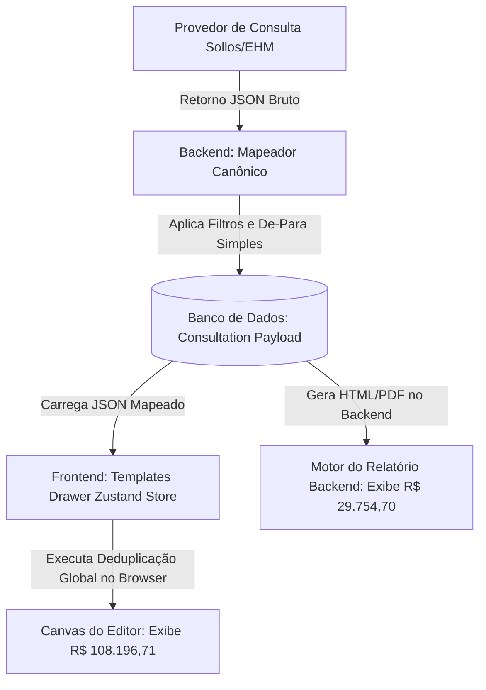

# Análise de Expressões de Totais e Divergências de Deduplicação

Este documento apresenta o diagnóstico completo sobre o comportamento da expressão `{{sum($[*].totaldeduzido)}}` no gerador de relatórios e no editor de templates, detalhando a causa raiz dos valores inconsistentes, as correlações entre as telas do sistema e a orquestração arquitetural recomendada para garantir a integridade e uniformidade dos dados.

---

## 📌 Visão Geral do Problema

Ao utilizar a expressão curinga `{{sum($[*].totaldeduzido)}}`, o sistema consolidou um valor considerado irreal de **R$ 188.196,71** (ou **R$ 108.196,71** em outros cenários de visualização) para o total de dívidas ativas, enquanto o total de débitos apontados brutos nos cards principais era exibido como **R$ 29.754,70** e a geração de PDFs no backend produzia valores totalmente diferentes.

### O que estava acontecendo?
1. **Soma Inflada e Redundante:** O curinga `$[*].totaldeduzido` varre recursivamente todas as chaves da raiz do JSON de dados da consulta. O motor de expressões localizou o campo `totaldeduzido` em seções onde ele não deveria existir ou onde os valores não foram limpos pela deduplicação global, somando-os cumulativamente:
   * **DIVIDAS_SPC:** `R$ 14.877,35` (recalculado pelo frontend)
   * **DIVIDAS_SERASA:** `R$ 14.877,35` (antes de ser zerada no recalculamento temporário do frontend)
   * **DIVIDAS_BOA_VISTA:** `R$ 93.319,36` (não deduplicada devido a divergências de datas e falta do campo chave de contrato)
   * **PROTESTO_CARTORIO:** `R$ 65.122,65` (protestos somados incorretamente como dívida financeira deduzida)
   * **Soma Total:** $14.877,35 + 14.877,35 + 93.319,36 + 65.122,65 = 188.196,71$.

2. **Divergência Crítica entre Frontend e Backend:** A lógica de deduplicação global/cross-type de dívidas e injeção forçada de `totaldeduzido` ocorre **exclusivamente no frontend** (no Zustand store do Templates Drawer). O backend grava no banco de dados o payload original mapeado do provedor sem aplicar a deduplicação global. Ao renderizar o PDF no backend, a mesma expressão gera outro valor (apenas a soma direta das seções gravadas no banco), quebrando a fidelidade do relatório impresso.

---

## 🛠️ Como Tudo Funciona (A Jornada dos Dados)

O fluxo de processamento de uma consulta e renderização de relatórios envolve três camadas principais interligadas:

### 1. Resposta do Provedor
O provedor retorna um JSON estruturado com ocorrências brutas agrupadas por bureau ou agrupamento genérico de pendências financeiras.

### 2. Tela de Mapeamento de Integrações
Na aba **Consultas**, o administrador define a associação dos dados brutos com a estrutura canônica:
* **Mapeamento de De-Para:** Associa caminhos físicos do JSON de origem aos campos canônicos do relatório (ex: `VALOR` -> `valor`, `DATA_VENCIMENTO` -> `data_ocorrencia`).
* **Critérios de Filtro:** Regras condicionais que filtram quais ocorrências pertencem a qual seção (ex: `INFORMANTE igual a BASE II` indica débitos do SPC).
* **Campos Calculados:** Expressões de agregação do tipo `Soma` ou `Média` para criar campos virtuais na seção (como `totalapontado` e `totaldeduzido`).

### 3. Editor de Templates e Expressões
No frontend, o motor de expressões (`resolveExpression.ts`) substitui variáveis formatadas como `{{sum($[*].totaldeduzido)}}`:
* O curinga `$[*]` instrui o motor a varrer cada seção na raiz do objeto de dados.
* Para cada seção, ele tenta recuperar o valor da chave `totaldeduzido` ou dentro de `totaisCalculados`.
* A função `sum(...)` converte os resultados de texto/moeda em números, realiza a soma matemática e reformata o valor final para exibição.

---

## ⚠️ Causas das Inconsistências de Dados

> [!WARNING]
> **Falta de Alinhamento de Chaves de Deduplicação:** 
> As dívidas da Boa Vista contêm os mesmos contratos e valores presentes no SPC (`0000033240021171` e `0000033240021463`), mas foram enviadas pelo provedor com datas de vencimento diferentes (em 2025 na Boa Vista vs 2021 no SPC) e a Boa Vista não possuía o campo chave `contrato` como critério de dedup configurado no banco. Por isso, a deduplicação global não conseguiu correlacionar os registros, mantendo as dívidas duplicadas ativas na Boa Vista.

> [!IMPORTANT]
> **Injeção de Campos Forçados no Frontend:**
> A rotina do frontend (`LeftPanel.tsx`) recalcula de forma forçada o `totaldeduzido` com base nas linhas remanescentes para todas as chaves em `activeDebtTypes`. Isso faz com que seções que não possuíam o campo calculado `totaldeduzido` originalmente configurado no catálogo ganhem esse valor dinamicamente, inflando a varredura global do curinga `$[*]`.

---

## 🎯 Orquestração Recomendada (Como Evitar Divergências)

Para garantir que o sistema funcione continuamente em harmonia, sem qualquer discrepância entre o que o administrador vê na tela do editor e o relatório gerado em PDF para o cliente, a arquitetura deve seguir estas diretrizes:

### 1. Centralização da Lógica de Negócio no Backend
A deduplicação global, aplicação de critérios de filtros e cálculo de totais acumulados **não devem ser responsabilidade do frontend**.
* O backend deve processar a resposta do provedor, aplicar a deduplicação cross-type e salvar o JSON **já totalmente limpo e consolidado** no banco de dados.
* O frontend deve funcionar como uma camada de visualização pura, apenas consumindo e exibindo o JSON mapeado que vem pronto do banco de dados.

### 2. Padronização do Motor de Expressões
A biblioteca ou função que resolve as expressões (`resolveExpression`) e agrega os valores deve ser compartilhada entre o frontend (JS/TS) e o gerador de relatórios do backend (Node.js/Prisma), garantindo que as mesmas regras de fallback e parsing de moeda funcionem sob os mesmos critérios de arredondamento.

### 3. Ajuste Fino nos Metadados do Catálogo de Integrações
Configurar chaves de deduplicação padronizadas para todos os bureaus de dívida comercial (SPC, Serasa e Boa Vista) usando o campo `contrato` normalizado (removendo zeros à esquerda ou caracteres especiais) para garantir a eficiência da deduplicação global mesmo quando houver pequenas variações de datas de inclusão entre os bureaus.
