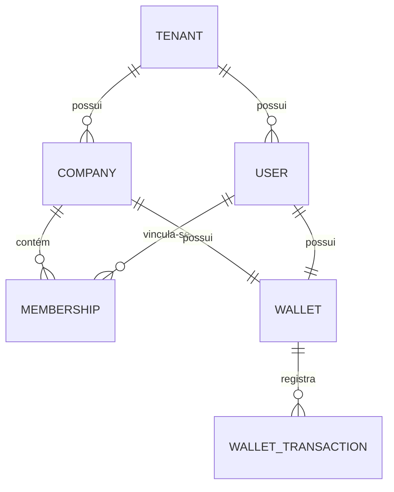
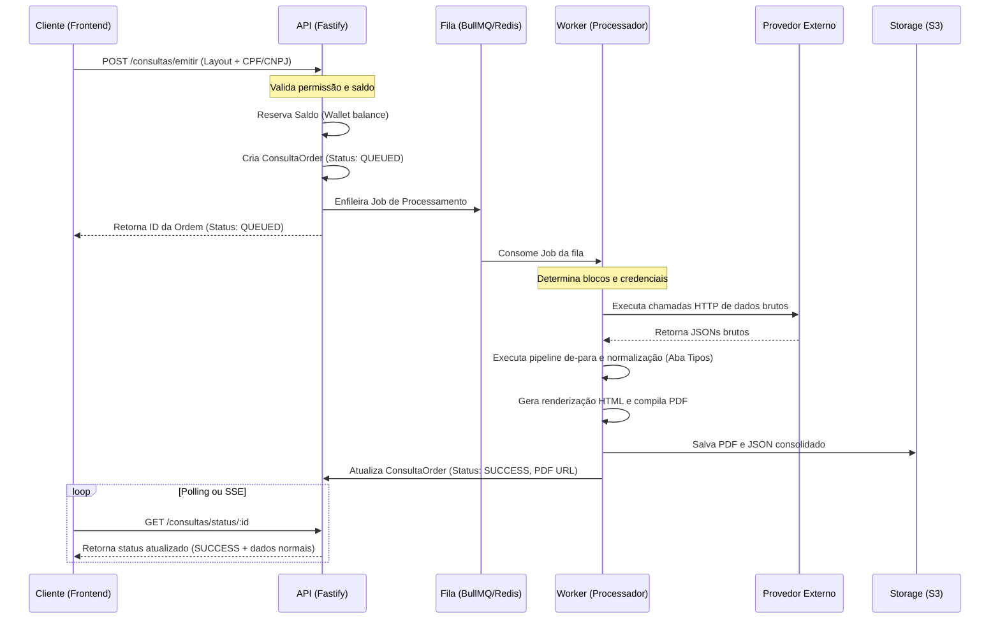

# Consultas PRO — Arquitetura de Back-end

## 1. Diretrizes Técnicas e Stack Canônica

O back-end do **Consultas PRO** foi construído como um monólito modular de alta performance, garantindo baixo overhead operacional, facilidade de manutenção e excelente escalabilidade.

A stack de tecnologia base é composta por:
- **Node.js 22 LTS** & **TypeScript** como ambiente de execução fortemente tipado.
- **Fastify 5** como framework HTTP, garantindo baixo overhead e ótimo desempenho na exposição de rotas e processamento de requests.
- **Prisma 6** como ORM (Object-Relational Mapping) seguro e tipado sobre o banco **PostgreSQL**.
- **Zod** para validação estrita de esquemas em tempo de execução (input/output de contratos e variáveis de ambiente).
- **BullMQ + Redis** para orquestração de processamento de filas de tarefas assíncronas em segundo plano, retentativas automáticas e jobs agendados.

---

## 2. Modelo de Dados Conceitual e Relacionamentos (Prisma PostgreSQL)

A integridade do banco de dados baseia-se no relacionamento entre as entidades de Tenant, Contas, Permissões e Carteiras, mapeando perfeitamente a lógica canônica do ecossistema:

### 2.1 Entidades Críticas de Negócio
- **Tenant**: Define o ecossistema do parceiro comercial ou a marca ativa. Toda entidade crítica do banco (usuários, companhias, ordens de consulta) armazena um `tenant_id` garantindo isolamento estrito de dados (arquitetura Multi-tenant com Banco de Dados único).
- **Company**: Organização corporativa que agrupa usuários. É vinculada a uma carteira (`Wallet`) e a uma tabela de preços específica (`PriceTable`).
- **User**: Cadastro de uma pessoa física no sistema (dados de autenticação, email, documento e senha hash).
- **Membership**: Tabela pivot que formaliza o vínculo de um usuário com uma companhia. Ela armazena o `role` do usuário na organização e as permissões de tela que ele possui de forma fina.
- **Wallet**: Carteira financeira. Pertence a uma companhia ou a um usuário individual, contendo o saldo atual (`balance`).
- **WalletTransaction (Ledger)**: Histórico financeiro detalhado de entradas, saídas, estornos e bônus.

---

## 3. O Motor de Processamento Assíncrono de Consultas (Fila de Jobs)

Devido às APIs de fornecedores de crédito apresentarem tempos de resposta variáveis e instabilidade de rede, o processamento de consultas é **100% assíncrono em segundo plano** estruturado com **BullMQ**:

### 3.1 Tratamento de Erros Parciais e Fallback
- **Isolamento de Falha**: Se um relatório possui 5 blocos de consulta de fontes diferentes, e apenas 1 falhar (ex: timeout de rede no provedor), o sistema aplica a política de erro parcial: consolida os outros 4 blocos e marca o bloco falhado com status específico.
- **Estorno Automático**: Na conclusão, o sistema recalcula o preço final cobrando apenas pelos blocos obtidos com sucesso. O saldo correspondente ao bloco falhado é devolvido à carteira (`WalletTransaction` do tipo `REFUND`).

---

## 4. Integridade Financeira (Ledger e Locks)

Operações financeiras de recarga e débitos de saldo de carteira exigem rigor de segurança extremo para evitar "double-spending" (gasto duplo) ou concorrência desordenada:

1. **Relação de Ledger Imutável**: O saldo de uma carteira (`Wallet.balance`) nunca deve ser incrementado ou decrementado de forma isolada. Toda e qualquer alteração de saldo exige a criação de uma `WalletTransaction` de forma atômica dentro da mesma transação de banco.
2. **Locking Pessimista**: Durante a emissão de uma consulta ou recarga, o backend executa um bloqueio de linha no banco de dados (`SELECT ... FOR UPDATE` via Prisma) para garantir que dois processos concorrentes em segundo plano não tentem ler e debitar do mesmo saldo simultaneamente.
3. **Idempotência de Webhooks**: Os pagamentos (via webhooks de gateways de PIX ou cartão) gravam um hash de referência exclusivo. Em caso de disparos duplicados do gateway, o sistema bloqueia e descarta requests repetidos garantindo que o crédito de saldo só seja concedido uma única vez.
