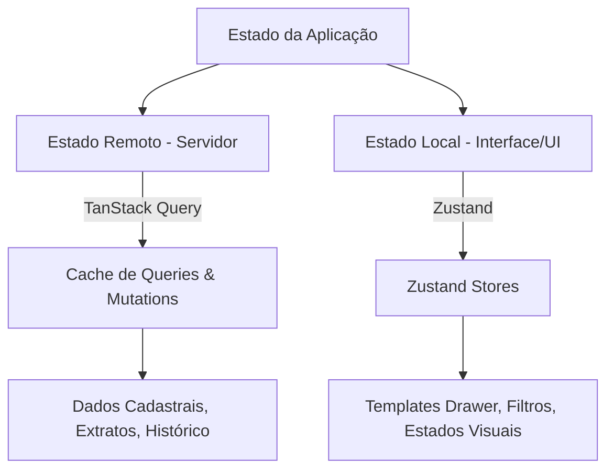

# Consultas PRO — Arquitetura de Front-end

## 1. Stack Canônica do Cliente

O lado cliente (front-end) do **Consultas PRO** foi projetado utilizando práticas modernas de desenvolvimento web, visando uma interface limpa, rápida, interativa e de baixíssima carga cognitiva:

- **React 18** (Vite 5) como motor do lado do cliente.
- **Tailwind CSS v3** para estilização flexível, modular e responsiva com foco em estética SaaS premium e moderna (Glassmorphism, transições suaves, acentos de cores Tailored).
- **shadcn/ui + Radix UI** fornecendo a base acessível e semântica para componentes de interface como diálogos, modais, drawers, popovers, accordions e dropdowns.
- **React Router** para navegação SPA e gerenciamento de rotas autenticadas e administrativas.

---

## 2. Gerenciamento de Estado Híbrido

Para otimizar o fluxo de dados, manter respostas instantâneas de tela e evitar buscas redundantes na API (overfetching), o front-end divide seu estado lógico em duas camadas distintas:



### 2.1 Estado de Servidor (`TanStack Query`)
Responsável pelo sincronismo, invalidação, cache e persistência de dados remotos vindos da API HTTP.
- Usado em tabelas de históricos, listagem de equipe, extratos financeiros e perfis.
- Garante atualizações em segundo plano invisíveis para o usuário e otimização de requisições.

### 2.2 Estado Local e Fluxos de Interface (`Zustand`)
Responsável pelo estado interativo, dinâmico e de renderização local das telas.
- **Templates Drawer Store**: Gerencia os blocos de layout ativos no canvas, os campos selecionados, os elementos em foco, o histórico de ações e o status de arrastar-e-soltar (drag-and-drop).
- **UI Global Store**: Controla estados abertos de sidebars, modais globais de confirmação, notificações e preferências de visualização (Dark/Light mode).

---

## 3. Controle de Permissões Dirigido por Capacidades (`PermissionGate`)

O acesso às telas e ações do front-end não é baseado puramente em papéis rígidos (RBAC estático), mas em **capacidades finas de permissão (Capabilities/Features)** obtidas no payload de autenticação.

Para simplificar a renderização condicional de botões e links de menu, o front-end consome o componente unificado `PermissionGate`:

```tsx
// Exemplo canônico de uso do PermissionGate para controle fino
import { PermissionGate } from "@/components/shared/PermissionGate";

export function TeamActions() {
  return (
    <div className="flex gap-2">
      <PermissionGate has="canInviteUsers">
        <Button onClick={openInviteModal}>Convidar Funcionário</Button>
      </PermissionGate>
      
      <PermissionGate has="canViewCompanyFinance">
        <Button variant="outline" onClick={exportFinancials}>
          Exportar Relatório Financeiro
        </Button>
      </PermissionGate>
    </div>
  );
}
```

### 3.1 Tratamento de Rotas Protegidas
- Se um usuário subordinado sem permissão tentar acessar uma rota restrita (como `/equipe` ou `/tecnico` administrativamente), o roteador intercepta a transição e o redireciona automaticamente para a página `/inicio` com um banner/toast de aviso "Acesso restrito".

---

## 4. UX e Responsividade por Etapas (Mobile Adaptive)

O sistema do Consultas PRO é altamente responsivo. No entanto, interfaces ricas como o **Builder de Consultas** e o **Templates Drawer** contêm painéis complexos em três colunas que se tornariam inutilizáveis em telas pequenas.

Para resolver isso, o front-end implementa a abordagem **Mobile Adaptive por Etapas**:

- **No Desktop**: Exibição síncrona de 3 colunas (Catálogo na esquerda, Canvas central de montagem, Resumo financeiro sticky na direita).
- **No Mobile**: A tela é segmentada automaticamente em um fluxo de **passos/etapas (Wizard)**:
  1. *Etapa 1 (Escolha de Dados)*: Exibe apenas o catálogo de blocos modulares.
  2. *Etapa 2 (Estruturação de Layout)*: Exibe a lista simplificada e ordenada de blocos incluídos para reordenação rápida de cards.
  3. *Etapa 3 (Dados e Confirmação)*: Mostra o formulário para informar o CPF/CNPJ de consulta, o custo total resumido e o botão de emitir.
- **Uso de Drawers**: Em telas mobile, as tabelas densas de histórico e extrato convertem ações pesadas para Drawers inferiores (que surgem deslizando do rodapé da tela), oferecendo toque mais intuitivo do que modais flutuantes.
