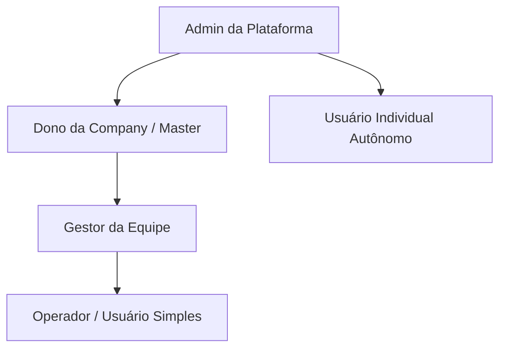

# Consultas PRO — Visão Geral e Arquitetura de Negócio

## 1. O que é o Consultas PRO?
O **Consultas PRO** é uma plataforma SaaS (Software as a Service) web responsiva de alta performance projetada para a consulta modular de dívidas, restrições cadastrais, análise cadastral e inteligência de dados de crédito. 

A plataforma inova no mercado ao introduzir uma experiência **100% self-service e dinâmica de personalização**: em vez de consumir relatórios de crédito fechados e engessados com preços fixos, o cliente final do Consultas PRO monta e desenha seu próprio layout de relatório, selecionando exatamente quais blocos de informações brutas de dados ele deseja consumir e visualizar.

---

## 2. Objetivos Principais do Produto

- **Modularidade de Consumo**: Permitir que o usuário inclua ou exclua blocos de consulta sob demanda, sabendo em tempo real o valor final do seu relatório antes de realizar a emissão.
- **Eficiência Financeira**: Oferecer o reuso de layouts e configurações de emissão salvos por meio de templates, economizando tempo e evitando retrabalhos de composição.
- **Flexibilidade Organizacional**: Suportar tanto a operação individual direta quanto a operação corporativa estruturada, com contas mestre e usuários subordinados em times.
- **Branding Personalizável (White-Label)**: Permitir que parceiros comerciais operem e revendam o ecossistema com sua própria marca (domínio customizado, logotipos e temas de cores), gerando isolamento comercial seguro.

---

## 3. Perfis de Acesso do Ecossistema

O sistema possui uma modelagem de controle de acesso fina dirigida por capacidades e permissões, estruturada inicialmente sob os seguintes perfis:

### 3.1 Admin da Plataforma
O nível de maior privilégio do sistema, responsável pela saúde operacional e financeira global:
- **Gestão Cadastral**: Cria, bloqueia e edita usuários, companhias e parceiros comerciais.
- **Controle de Saldo**: Credita ou debita valores das carteiras com registro obrigatório de auditoria e justificativa manual.
- **Gestão Comercial**: Configura Tabelas de Preços globais ou customizadas e as atribui a companhias ou parceiros específicos.
- **Biblioteca Global**: Gerencia e publica os templates/layouts de relatórios do sistema que ficam disponíveis como modelos prontos para uso.
- **Monitoramento Técnico**: Visualiza integridade de conexões de fornecedores, filas de processamento assíncrono e trilhas completas de auditoria.

### 3.2 Dono da Company (Master / Company Owner)
Representa a conta principal de uma empresa cliente:
- **Gestão de Equipe**: Convida, ativa, desativa e remove funcionários subordinados vinculados à sua companhia.
- **Carteira Centralizada**: Gerencia a carteira financeira de saldo da companhia, que é compartilhada por toda a sua equipe para emissão de consultas.
- **Auditoria de Consumo**: Acompanha em gráficos e tabelas o consumo financeiro consolidado e o gasto específico por membro de equipe.
- **Templates de Equipe**: Cria layouts de relatórios e decide se eles serão de uso exclusivo dele ou se serão compartilhados com os subordinados da companhia.

### 3.3 Gestor de Company (Company Manager)
Perfil administrativo intermediário dentro de uma empresa cliente, auxiliando o Dono:
- **Acompanhamento**: Visualiza o histórico de consultas de toda a equipe e baixa PDFs.
- **Gestão Limitada**: Convida operadores, mas não pode alterar configurações corporativas críticas ou tabelas de preços associadas à empresa.

### 3.4 Operador (Company Operator / Usuário Simples)
Perfil operacional final de menor privilégio dentro de uma companhia:
- **Operação de Consultas**: Emite consultas utilizando os templates disponibilizados e autorizados pela empresa.
- **Consumo do Saldo**: Utiliza diretamente o saldo compartilhado da carteira mestre da companhia (não possui saldo próprio).
- **Histórico Restrito**: Visualiza apenas o seu próprio histórico de consultas e relatórios emitidos, não enxergando a atividade de outros membros.

### 3.5 Usuário Individual (Autônomo)
Equivale a uma pessoa física ou microempresa que utiliza a plataforma de forma isolada:
- **Sem Equipe**: Não possui equipe subordinada nem se vincula a companhias maiores.
- **Saldo Próprio**: Mantém sua própria carteira financeira individual com recargas via PIX ou cartão.
- **Total Controle**: Cria e salva seus templates particulares, emite consultas e acompanha seu extrato de forma direta.

---

## 4. Modelos Operacionais de Conta e Vínculos

O Consultas PRO separa logicamente a entidade **Pessoa (User)** da entidade **Organização (Company)**. Isso viabiliza dois fluxos operacionais transparentes na carteira de saldos:

### 4.1 Modelo de Conta Individual
Nesse modelo, o usuário (`User`) é autônomo. O saldo financeiro fica diretamente atrelado à sua carteira individual (`Wallet`). A tomada de decisão, o consumo e as recargas são todos centralizados em sua conta direta.

### 4.2 Modelo de Conta Company (Corporativo)
Nesse modelo, existe uma entidade corporativa (`Company`) que possui a carteira central de saldo (`Wallet`). 
- **Mapeamento de Vínculo (`Membership`)**: Os funcionários são usuários normais vinculados à companhia através de uma tabela de relacionamento (`Membership`), a qual armazena o seu papel específico (`Owner`, `Manager` ou `Operator`) e suas permissões dinâmicas de tela.
- **Consumo Centralizado**: Ao emitir uma consulta, o sistema valida as permissões do usuário logado, mas realiza o débito financeiro na carteira central da companhia à qual ele está vinculado.
- **Trilha de Auditoria**: O débito na carteira e o registro no extrato gravam tanto o ID da companhia responsável pelo pagamento quanto o ID do usuário físico que disparou a emissão, garantindo conformidade operacional de quem executou a ação.
