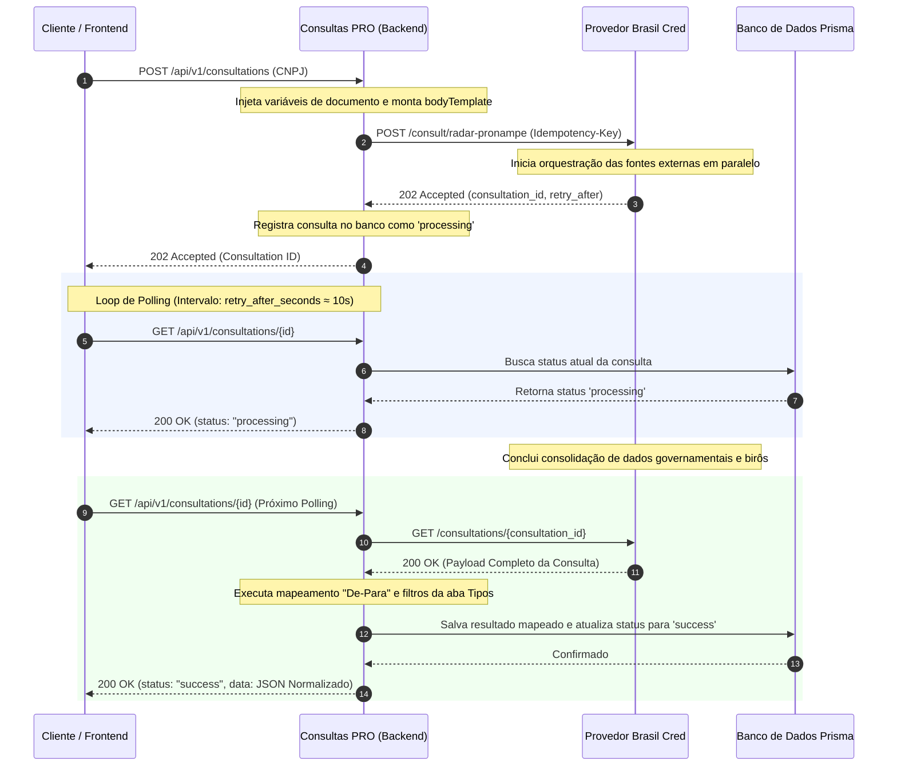

# 📡 Integração Brasil Cred — Fluxo Assíncrono (Radar PRONAMPE)

Este documento detalha a arquitetura técnica, fluxo de rede, tratamento de idempotência e mecanismos de polling aplicados na integração com a **Brasil Cred** no **Consultas PRO**, focando especificamente no produto **Radar PRONAMPE PJ** (`RADAR_PRONAMPE_PJ`).

---

## 🏛️ 1. O Modelo Assíncrono de Consulta (202 Accepted)

Diferente de consultas cadastrais simples que respondem de forma síncrona em frações de segundos, o produto **Radar PRONAMPE (CNPJ)** envolve o cruzamento em tempo real de dezenas de fontes governamentais e birôs privados de alta densidade (Receita Federal, PGFN, Procuradoria Geral, Quod, SCR Bacen, Boa Vista, etc.). 

Para evitar timeouts de requisição HTTP e travamento de threads de execução no backend, a API da Brasil Cred utiliza o padrão de **Processamento Assíncrono (CQRS/Polling)**.

### 🔄 Diagrama de Sequência de Ponta a Ponta



---

## 🛠️ 2. Especificação Técnica da Requisição Inicial

### 2.1. Endpoint e Autenticação
* **Endpoint**: `POST <BASE_URL>/consult/radar-pronampe`
* **Headers de Requisição**:
  ```http
  Content-Type: application/json
  Authorization: Bearer <TOKEN_DE_PARCEIRO_BRASIL_CRED>
  Idempotency-Key: <UUID_UNICO_DA_TENTATIVA>
  ```

### 2.2. Corpo da Requisição (`bodyTemplate`)
O corpo da requisição é minimalista e focado unicamente no documento do alvo (CNPJ). 

> [!IMPORTANT]
> O `bodyTemplate` do produto `RADAR_PRONAMPE_PJ` no banco de dados deve ser configurado exatamente como o JSON abaixo, utilizando a variável `$document` (resolvida dinamicamente pelo motor do backend antes do disparo):
> ```json
> {
>   "document": "$document"
> }
> ```

---

## 🔀 3. Tratamento de Idempotência e Retentativas

Como o processamento assíncrono consome créditos na Brasil Cred imediatamente no aceite da requisição (retorno `202`), o tratamento de duplicidade e falha de rede é crucial para **evitar prejuízos financeiros por cobranças duplicadas**.

1. **Geração do Idempotency-Key**: O backend gera um hash criptográfico (SHA-256) baseado na combinação do `CNPJ do Alvo` + `ID do Usuário Solicitante` + `Data da Requisição (Y-m-d)`.
2. **Retentativas Seguras**: Se ocorrer uma falha de conexão física ou perda de pacotes logo após o Consultas PRO enviar a requisição e antes de receber o `202`, o motor de retentativas reenvia o payload utilizando a **mesma chave de idempotência**.
3. **Comportamento do Provedor**: 
   - Ao receber uma requisição com chave de idempotência já em processamento, a Brasil Cred não gera uma nova consulta e não cobra novamente. Ela simplesmente devolve o código `202 Accepted` original com o mesmo `consultation_id` anterior.
   - Isso garante resiliência absoluta e tarifa zero de desperdício.

---

## 🕵️ 4. O Mecanismo de Polling (Orquestração de Respostas)

O backend do Consultas PRO implementa um worker interno inteligente para as chamadas de polling:

* **Frequência de Polling**: O header de resposta `Retry-After` ou a propriedade `retry_after_seconds` recebida no payload de aceite (geralmente `10`) é respeitada como delay mínimo.
* **Detecção de Estado**:
  - `processing`: O backend responde ao cliente final com o estado parcial e mantém a conexão em aberto ou instrui o frontend a tentar novamente em X segundos.
  - `success`: O payload consolidado é baixado, as chaves "De-Para" da aba **Tipos** são processadas, os filtros canônicos de deduplicação e limpeza são aplicados, e o resultado limpo é persistido no banco local.
  - `partial`: Ocorre quando algumas fontes (ex: SCR Bacen) falharam no tempo limite mas as informações cadastrais e Receita Federal foram obtidas com sucesso. O relatório é gerado com os dados disponíveis e as seções vazias são auto-ocultadas (`hiddenIfEmpty`).
  - `error`: Falha total crítica no birô externo. O saldo do usuário é estornado de forma automática no ledger de créditos.

---

## 📁 5. Estrutura do Payload de Resultado Real (Mapeado e Filtrado)

Ao atingir o estado `success`, o JSON retornado pela Brasil Cred contém uma rica árvore de sub-objetos. No Consultas PRO, esses dados são normalizados para os seguintes sub-escopos (pathKeys canônicos) para consumo direto no Templates Drawer:

| PathKey de Destino | Caminho de Origem no JSON Bruto | Descrição |
|---|---|---|
| `PRONAMPE_RESULTADO` | `recomenda.data` | Score de elegibilidade, recomendação de venda e limite de crédito estimado. |
| `PRONAMPE_SOCIOS` | `recomenda.data.quadroSocietarioCompleto` | Dados cadastrais, percentual de participação e restrições dos sócios. |
| `PRONAMPE_PGFN` | `pgfn.retorno.naturezas` | Dívidas ativas tributárias e não-tributárias com a União. |
| `PRONAMPE_RECEITA` | `recomenda.data` | Dados cadastrais oficiais da Receita Federal (CNAE, Capital Social, Natureza Jurídica). |
| `PRONAMPE_BUREAUS` | `[mesclagem de quod/boa-vista]` | Notas e faixas de risco dos birôs Quod e Boa Vista integrados no Radar. |
| `PRONAMPE_BACEN` | `scrBacen.retorno` | Histórico e limites da Carteira de Crédito SCR (vencer, vencido e prejuízos). |

---

> [!TIP]
> **Dica de Depuração**: Para simular o fluxo completo do Radar PRONAMPE no ambiente local sem consumir créditos da API de produção da Brasil Cred, utilize o arquivo de log sintético localizado em [radar_pronampe_brasilconsultas.json](file:///consultas-pro-app/logs/radar_pronampe_brasilconsultas.json) carregando-o diretamente na aba **Consultas** do painel de administração das integrações.
