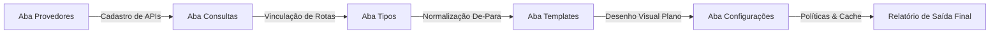

# Pipeline de Integrações — O Ciclo de Vida do Dado

## 1. O Conceito por trás do Módulo de Integrações

O maior desafio em plataformas de inteligência de crédito e dados cadastrais é a **heterogeneidade de formatos**: cada fornecedor externo (Serasa, SPC, Boa Vista, Receita Federal, Sollos, etc.) retorna suas respostas em formatos JSON totalmente diferentes, com nomenclaturas de chaves distintas e padrões desregulados. Além disso, uma única consulta pode mesclar dados de múltiplos fornecedores.

Para solucionar esse problema de forma escalável e elegante, o **Consultas PRO** implementa um **Pipeline de Integrações de Dados em 5 Etapas**, configurável visualmente através de 5 abas no painel `/integracoes`:

---

## 2. Detalhando as 5 Abas de Integração

Abaixo, descrevemos a responsabilidade de cada uma das abas configuráveis na interface de backoffice do sistema:

### 2.1 Aba `provedores`
É a camada física de comunicação. Cadastra e configura os fornecedores/fornecedoras externas de dados.
- **Campos**: Nome do provedor, URL base da API, Headers de autenticação (API Keys, Bearer Tokens), Métodos HTTP, Certificados SSL e Credenciais de acesso de produção e homologação.
- **Função**: Centralizar onde e como buscar a informação bruta, encapsulando as conexões de baixo nível de rede.

### 2.2 Aba `consultas`
É a camada comercial e de identificação de serviços que o sistema expõe para venda.
- **Campos**: Nome comercial da consulta, identificador único, preço de custo base do fornecedor, preço sugerido de venda e rotas específicas.
- **Função**: Associa a rota técnica de um provedor a um produto comprável pelo cliente (ex: a rota `/v1/protests` do Provedor Sollos vira a consulta comercial "Relatório Completo de Protestos Estaduais").

### 2.3 Aba `tipos` (Normalização e De-Para)
É a **inteligência de dados** do sistema. Traduz as respostas desestruturadas e heterogêneas dos fornecedores em uma estrutura de dados unificada, limpa e padronizada.
- **Função**: Mapeia as chaves brutas de retorno do fornecedor (chaves "De") para as chaves normalizadas da nossa plataforma (chaves "Para"). É o tradutor oficial do sistema.
- **Operações**: Além da tradução de nomes de chaves, realiza a limpeza de dados, conversões de tipos, filtros condicionais em arrays de dados e criação de campos calculados dinâmicos.

### 2.4 Aba `templates` (Templates Drawer)
É o **designer visual interativo** do relatório de consulta que será exibido na tela ou impresso no PDF final.
- **Função**: Permite arrastar e soltar seções, tabelas, títulos e cards em um canvas dinâmico.
- **Regra de Ouro**: O Templates Drawer **não enxerga dados brutos do provedor (chaves "De")**. Ele é totalmente agnóstico de qual fornecedor gerou o dado. Ele consome unicamente as chaves unificadas e planas ("Para") definidas na aba `tipos`.
- **Fórmulas**: Suporta cálculos e expressões estilo Excel para totalizações através da engine de cálculo do sistema.

### 2.5 Aba `configuracoes`
Controla os parâmetros operacionais e as regras de fallback/cache da consulta.
- **Campos**: Tempo de vida do cache (TTL) para evitar consultas redundantes e cobranças duplicadas do fornecedor no mesmo CPF/CNPJ, timeout limite de rede, política de erros parciais e estorno de créditos.
- **Função**: Ajustar a engrenagem operacional para garantir estabilidade financeira e técnica ao fluxo.

---

## 3. Fluxo de Vida do Dado: Do JSON Bruto ao Relatório Final (Ponta a Ponta)

Para entender a unificação, imagine que temos dois fornecedores que retornam dados de cheques sem fundo.

### Passo 1: Recebimento do Dado Bruto (Aba Provedores e Consultas)
- **Provedor A** retorna a lista de cheques na chave `response.cheques_devolvidos` como um array.
- **Provedor B** retorna a lista na chave `data.cheques.list_of_cheques` como um array.

### Passo 2: Tradução e Normalização (Aba Tipos)
Na aba `tipos`, o desenvolvedor configura o mapeamento "De-Para":
- No mapeamento do **Provedor A**, ele aponta `response.cheques_devolvidos` -> `cheques_sem_fundo` (nossa chave padronizada).
- No mapeamento do **Provedor B**, ele aponta `data.cheques.list_of_cheques` -> `cheques_sem_fundo`.

A partir deste instante, o sistema normalizou o dado. Ambos os provedores agora alimentam a mesma propriedade unificada: `cheques_sem_fundo`.

### Passo 3: Composição de Layout (Aba Templates)
Ao desenhar o template de impressão no **Templates Drawer**, o designer insere uma tabela no canvas e define que a fonte de dados dessa tabela é a variável `cheques_sem_fundo`.
- **Agnosticismo Total**: O template não precisa saber se o dado veio do Provedor A ou do Provedor B. Desde que o mapeamento "Para" tenha sido feito corretamente na aba `tipos`, o mesmo layout renderizará perfeitamente as informações de qualquer fornecedor de forma idêntica e unificada!
