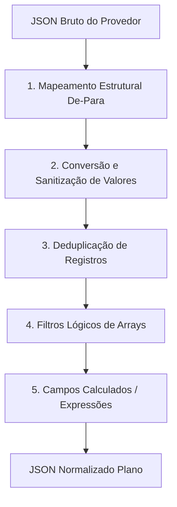

# A Inteligência de Dados — Aba Tipos (Mapeamento De-Para)

## 1. O Papel da Aba Tipos

A aba **Tipos** é o cérebro de processamento de dados do **Consultas PRO**. Ela é responsável por realizar a transformação física do payload JSON bruto recebido do fornecedor (chaves "De") para a estrutura de dados padronizada da nossa plataforma (chaves "Para").

Este mapeamento elimina a complexidade no desenvolvimento do front-end e no design de templates, pois unifica propriedades equivalentes sob uma mesma nomenclatura de variável plana.

---

## 2. Recursos e Métodos de Transformação de Dados

O mapeamento na aba **Tipos** é composto por uma sequência de etapas lógicas de transformação:



### 2.1 Mapeamento Estrutural De-Para
Associa as chaves de objetos e arrays da resposta original do fornecedor a uma chave de destino exclusiva do Consultas PRO.
- **De (Origem)**: Caminho do JSON bruto (ex: `resultado.restricoes_financeiras.lista_negativa`).
- **Para (Destino)**: Chave unificada plana (ex: `restricoes_spc`).

### 2.2 Conversão e Sanitização de Valores
Corrige inconsistências e traduz códigos numéricos ou strings proprietárias em dados inteligíveis com base no tipo configurado (Moeda, Percentual, Inteiro, Data, Texto, CPF/CNPJ):
- **Normalização de Booleanos**: Converte valores inconsistentes como `"S"`, `"Y"`, `1`, `"true"` para booleano real `true`, e `"N"`, `"Nao"`, `0` para `false`.
- **Tradução de Status**: Traduz códigos numéricos do provedor para strings amigáveis.
  - *Exemplo*: Se o campo `status_code` vier como `"01"`, traduz para `"Ativo"`. Se vier como `"02"`, traduz para `"Baixado/Regularizado"`.

### 2.3 Deduplicação de Registros (Deduplicate)
O provedor de dados às vezes envia ocorrências idênticas ou duplicadas em momentos de transição do sistema ou erros de processamento interno deles.
- **Como funciona**: Na interface de mapeamento da aba **Tipos**, o administrador pode ativamente selecionar chaves do array de dados como critérios de deduplicação (ex: marcando a caixa de seleção `DEDUPLICAR` nas chaves `Valor` ou `Data Ocorrência`).
- **Comportamento**: Durante a normalização, o motor agrupa as linhas do array e remove as ocorrências duplicadas baseando-se nas chaves marcadas, mantendo apenas um único registro limpo e único.

### 2.4 Filtros Lógicos de Arrays
Permite reduzir listas densas vindas do fornecedor, mantendo apenas os registros de interesse que obedeçam a regras lógicas específicas (critérios de correspondência).
- *Cenário Comum*: O provedor retorna uma lista contendo tanto restrições financeiras "Ativas" quanto restrições "Baixadas" dos últimos 5 anos no mesmo array.
- *Solução com Filtro*: Criar uma regra na aba Tipos definindo que a variável `restricoes_ativas` receberá o array original aplicando a condição de filtro: `status == "Ativo"`. O array final unificado conterá apenas os itens relevantes, reduzindo o processamento no front-end.

### 2.5 Campos Calculados (Expressões JavaScript / Agregações)
Permite a criação de propriedades virtuais que não existem no JSON original do fornecedor, calculadas dinamicamente em tempo de processamento através de expressões em JavaScript ou regras de agregação configuradas (Soma, Contagem, Média):
- **Somas e Totais**: Percorre arrays para somar valores de dívidas (ex: calcular a soma de todas as restrições e criar a chave calculada `total_restricoes_valor`).
- **Formatação**: Unificar campos como `ddd` e `telefone` em uma chave calculada única `telefone_completo` aplicando máscaras.
- **Lógicas Condicionais**: Criar chaves booleanas como `possui_restricoes` (`restricoes.length > 0`) para facilitar renderizações condicionais de alertas vermelhos no relatório visual.

### 2.6 Isolamento de Filtros por Consulta + Tipo (Evitando Contaminação Global)
Um aspecto crítico da inteligência de dados da nossa plataforma é o **isolamento de critérios por produto**.
- **O Problema Antigo**: Antigamente, os filtros eram globais por tipo canônico (`CanonicalField`). Isso significava que se o usuário definisse um filtro de SPC, a regra vazava e contaminava relatórios de Serasa que compartilhassem o mesmo tipo "Restrição", misturando as regras.
- **A Regra Canônica Atual**: Os critérios de filtro e deduplicação pertencem estritamente à relação **Consulta (Produto) + Tipo Canônico**. O banco de dados armazena essa inteligência na tabela `ProviderProduct` dentro do campo JSON `itemFiltersByCanonicalPath`. Assim, cada consulta isolada possui suas próprias regras de filtragem e de-para personalizadas, mesmo compartilhando tipos ou fornecedores idênticos.

---

## 3. Exemplo Prático de Configuração

### 3.1 JSON Original do Provedor (Entrada "De")
```json
{
  "retorno_api": {
    "status_busca": "OK",
    "dados_restritivo": {
      "lista_pendencias": [
        { "cod_registro": "A10", "valor_divida": "1480.50", "situacao": "ABERTO", "dt_ocorrencia": "2026-01-15" },
        { "cod_registro": "A10", "valor_divida": "1480.50", "situacao": "ABERTO", "dt_ocorrencia": "2026-01-15" },
        { "cod_registro": "B20", "valor_divida": "350.00", "situacao": "REGULARIZADO", "dt_ocorrencia": "2025-11-20" }
      ]
    }
  }
}
```

### 3.2 Configurações de Mapeamento Aplicadas na Aba Tipos:
1. **Mapeamento**:
   - `retorno_api.dados_restritivo.lista_pendencias` -> `pendencias_origem`
2. **Deduplicação**:
   - Ativada para `cod_registro` e `valor_divida` (remove a linha duplicada "A10" sobressalente).
3. **Filtro Aplicado**:
   - Criar `pendencias_ativas` filtrando `pendencias_origem` onde `situacao == "ABERTO"`.
4. **Conversão de Valores** (sobre o array resultante):
   - Traduzir `situacao` onde `"ABERTO"` vira `"Ativa"`.
5. **Campo Calculado**:
   - Criar `total_pendencias_valor` com a expressão de soma agregada ou Javascript:
     `pendencias_ativas.reduce((acc, curr) => acc + parseFloat(curr.valor_divida), 0)`
   - Criar `possui_pendencias` com a expressão: `pendencias_ativas.length > 0`.

### 3.3 JSON Final Normalizado (Saída "Para" consumida pelo Templates Drawer)
```json
{
  "pendencias_origem": [
    { "cod_registro": "A10", "valor_divida": 1480.50, "situacao": "Ativa", "dt_ocorrencia": "15/01/2026" },
    { "cod_registro": "B20", "valor_divida": 350.00, "situacao": "Regularizada", "dt_ocorrencia": "20/11/2025" }
  ],
  "pendencias_ativas": [
    { "cod_registro": "A10", "valor_divida": 1480.50, "situacao": "Ativa", "dt_ocorrencia": "15/01/2026" }
  ],
  "total_pendencias_valor": 1480.50,
  "possui_pendencias": true
}
```
*(Repare como a estrutura de saída se torna limpa, plana, unificada e sem as redundâncias de duplicatas brutas do provedor).*
