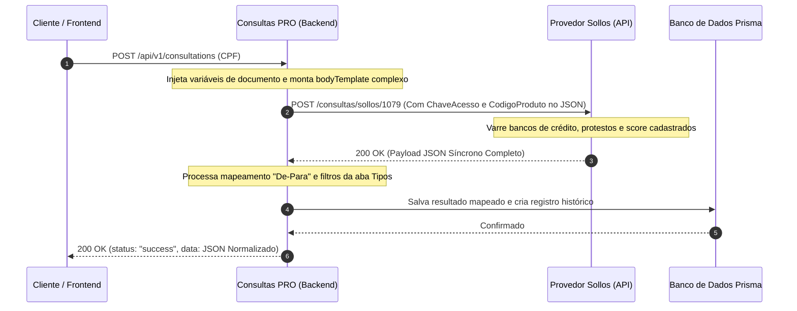

# 🔌 Integração Sollos — Fluxo Síncrono (Completa Brasil + Score CPF)

Este documento detalha o funcionamento, arquitetura de rede, estrutura do payload complexo e processamento síncrono da integração com a **Sollos** no **Consultas PRO**, focando especificamente no produto **Completa Brasil + Score CPF** (Código do Provedor: `1079`).

---

## 🚀 1. O Modelo Síncrono de Consulta (Tempo Real)

Diferente das consultas assíncronas de longa duração, as consultas integradas via **Sollos** utilizam uma arquitetura de **Resposta Síncrona em Tempo Real**. 

Ao enviar a requisição, o thread de execução do backend aguarda a conexão HTTP aberta com a Sollos enquanto ela varre seus bancos locais. A resposta é entregue na mesma requisição HTTP (geralmente em menos de 3.5 segundos).

### 🔄 Diagrama de Sequência de Ponta a Ponta



---

## 🎛️ 2. Especificação Técnica da Requisição (O Payload Complexo)

Diferente de provedores que utilizam autenticação HTTP baseada em headers `Authorization: Bearer`, a Sollos exige que as credenciais e parâmetros operacionais de webhook e roteamento sejam envelopados **diretamente no corpo do JSON da requisição** (Request Payload).

### 2.1. Regra de Ouro para o `bodyTemplate`

Para o produto **Completa Brasil + Score CPF (1079)**, o campo `bodyTemplate` no banco de dados deve ser mantido como um JSON complexo estruturado. 

> [!WARNING]
> Nunca simplifique o corpo de requisição do Sollos para um JSON genérico contendo apenas `{ "document": "{{document}}" }`. Isso quebra o validador do gateway da Sollos, pois o provedor exige que o token de autorização (`ChaveAcesso`) e o código do produto (`CodigoProduto`) trafeguem explicitamente no body.

### 2.2. JSON do Corpo da Requisição Padrão (`bodyTemplate`)

No Consultas PRO, o template padrão para a chamada do Sollos é estruturado da seguinte forma:

```json
{
  "Info": {
    "Solicitante": "IDENTIFICAÇÃO DO CLIENTE FINAL (OPCIONAL)"
  },
  "Versao": "20180521",
  "WebHook": {
    "UrlCallBack": ""
  },
  "Parametros": {
    "CPFCNPJ": "{{document}}",
    "TipoPessoa": "F"
  },
  "ChaveAcesso": "ZzM67lS3CL7SSW6680p9fEcNPcD5wE88aSQa/D3EnDeL6cnwsrkpmrCsSt4dssftiiooSega",
  "CodigoProduto": "1079"
}
```

* **`Parametros.CPFCNPJ`**: O parâmetro dinâmico `{{document}}` é mapeado e injetado em tempo de execução com o CPF/CNPJ do alvo limpo de formatação.
* **`ChaveAcesso`**: Token de autenticação física privado do cliente cadastrado para acesso direto à API da Sollos.
* **`CodigoProduto`**: O código numérico rígido `"1079"` que especifica o tipo de consulta física (Completa Brasil + Score) contratada junto ao birô.

---

## 📊 3. Normalização e Tratamento de Dados do Sollos

Ao receber o retorno da Sollos, o backend utiliza os mapeamentos e regras configurados na aba **Tipos** para desestruturar e normalizar a resposta nos seguintes sub-escopos canônicos:

### 3.1. Dados Pessoais (`DADOS_PESSOAIS`)
Mapeia campos cadastrais e de localização do alvo:
- `DADOS_PESSOAIS.NOME` -> Mapeia `retorno.nome`
- `DADOS_PESSOAIS.DATA_NASCIMENTO` -> Mapeia `retorno.dataNascimento`
- `DADOS_PESSOAIS.SITUACAO_CADASTRAL` -> Mapeia `retorno.situacaoCadastral`

### 3.2. Restrições e SPC (`DIVIDAS_SPC`)
Limpa e filtra dívidas financeiras e comerciais ativas do birô SPC:
- `DIVIDAS_SPC.QUANTIDADE` -> Soma das ocorrências ativas ou contagem de linhas de débitos.
- `DIVIDAS_SPC.VALOR_TOTAL` -> Agregação (`math()`) das dívidas mapeadas aplicando sanitização de moeda.

### 3.3. Score de Crédito (`SCORE_CREDITO`)
Extrai a pontuação e faixa de risco do consumidor:
- `SCORE_CREDITO.SCORE` -> Mapeia `retorno.score.pontuacao`
- `SCORE_CREDITO.CLASSIFICACAO` -> Mapeia `retorno.score.classificacao`

---

## 🎨 4. Renderização Dinâmica e Colorização no Layout

O layout do relatório unificado do Sollos utiliza as **Expressões Condicionais Premium** para ajustar a estética das cores do score conforme o risco, oferecendo uma experiência visual impressionante para o cliente.

### 4.1. Regra de Negócio de Cores do Score
As faixas de pontuação do score são segmentadas e colorizadas dinamicamente através do novo interpretador lógico:

```handlebars
{{VAR score = $SCORE_CREDITO[0].score VAR cor = case when score <= 200 then "#ef4444" when score <= 400 then "#f97316" when score <= 600 then "#eab308" when score <= 800 then "#84cc16" else "#22c55e" end RETURN cor}}
```

Esta expressão é injetada diretamente nos elementos do **Templates Drawer** (como cores de fontes, bordas de cartões e ponteiros de gráficos), garantindo que um score baixo seja destacado em vermelho (`#ef4444`) e um score excelente brilhe em verde esmeralda (`#22c55e`).
