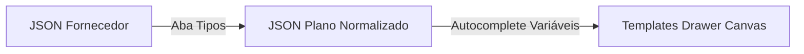

# Designer de Relatórios — O Templates Drawer (Aba Templates)

## 1. O que é o Templates Drawer?

O **Templates Drawer** é a ferramenta de design visual (comportamento drag-and-drop / arrastar e soltar) do **Consultas PRO**. Ele permite que designers e analistas montem a estrutura física, estética e lógica dos relatórios de consulta sem escrever código HTML ou CSS diretamente.

A interface consiste de:
- **Painel Esquerdo**: Catálogo de Elementos (Títulos, Textos, Tabelas, Alertas, Imagens, Seções) e o **Autocomplete de Variáveis**.
- **Canvas Central**: Área de trabalho interativa onde os elementos são arrastados, organizados, ordenados e editados.
- **Painel Direito (Inspetor de Propriedades)**: Configurações do elemento ativo selecionado (estilo, fonte, cor, bordas, visibilidade condicional e variáveis dinâmicas associadas).

---

## 2. A Regra de Ouro: Dados Planos e Variáveis "Para"

Para garantir que um layout de relatório seja independente de qual fornecedor gerou a informação, o Templates Drawer **opera unicamente sobre a estrutura plana ("Para") unificada**.



- **Sem Chaves Fantasmas**: No autocomplete e no painel esquerdo do Templates Drawer, as únicas variáveis exibidas e sugeridas são as chaves destino unificadas ("Para") declaradas na aba **Tipos**.
- **Precisão Cirúrgica**: Se um campo do Tipo não foi mapeado de forma ativa, ele não deve aparecer no templates drawer. Campos padrão de metadados rígidos (como `.quantidade` injetado de forma hardcoded) foram removidos para evitar divergências técnicas com o catálogo de integrações selecionado.
- **Tratamento Dinâmico de Valores**: O motor do Drawer lê as propriedades do JSON normalizado e preenche o canvas em tempo real.
- **Prevenção de Quebras de Layout**: Se uma variável de mapeamento estiver vazia no retorno da busca (ex: um cliente sem cheques sem fundo), o componente correspondente no Drawer (seja um bloco de texto ou uma tabela inteira) possui regras automáticas de auto-ocultação (`hiddenIfEmpty`) para evitar exibir campos vazios ou órfãos no PDF final.

---

## 3. Elementos Dinâmicos e Tabelas Autoajustáveis

O Templates Drawer suporta elementos sofisticados que se adaptam dinamicamente ao tamanho dos dados:

### 3.1 Tabelas Dinâmicas
- Quando o usuário arrasta uma **Tabela** para o canvas, ele define as colunas e as vincula a propriedades de um array unificado (ex: colunas *Banco*, *Valor*, *Data* mapeadas para as propriedades de `pendencias_ativas`).
- Durante a renderização, a tabela cresce ou reduz dinamicamente de forma automática, criando novas linhas físicas conforme a quantidade de registros retornados no array de dados, respeitando quebras de página automáticas do motor PDF.

### 3.2 Alertas e Seções Condicionais
- É possível definir regras de visibilidade condicional para seções inteiras (ex: exibir a Seção "ALERTA CRÍTICO DE RESTRIÇÕES" apenas se a variável calculada `possui_pendencias` for igual a `true`).

---

## 4. O Motor de Fórmulas Estilo Excel (`math()`)

Uma das capacidades mais sofisticadas do Templates Drawer é o cálculo de somas e operações financeiras diretamente no layout de visualização usando fórmulas estilo Excel através do componente `math()`.

```excel
= math(SUM(pendencias_ativas.valor_divida))
```

### 4.1 Purificação de Strings Monetárias Brasileiras
Um problema recorrente na orquestração de APIs é que muitos provedores enviam dados monetários já formatados como strings brasileiras (ex: `"R$ 14.877,35"` ou `"1.480,50"`), impossibilitando operações matemáticas diretas de soma (`SUM`) ou multiplicação, pois o JavaScript os interpreta como texto.

Para solucionar isso, o motor de expressões do Templates Drawer possui um pipeline nativo de **purificação de valores** integrado:
1. **Identificação**: Ao executar a função `math()`, o motor analisa as variáveis envolvidas no cálculo.
2. **Purificação (Sanitização)**: Se encontrar strings contendo símbolos monetários (`R$`, `$`), espaços ou separadores de milhar em formato brasileiro (pontos para milhar e vírgula para decimal), o interpretador executa uma regex de limpeza:
   - Remove o prefixo `R$` e espaços.
   - Remove os pontos de milhar (`.`).
   - Substitui a vírgula decimal por ponto (`,` -> `.`).
   - Converte a string resultante em um número float de alta precisão (ex: `"R$ 14.877,35"` vira `14877.35` em ponto flutuante puro).
3. **Cálculo**: Executa a operação matemática com segurança absoluta.
4. **Formatação de Saída**: O resultado é reformatado automaticamente de volta para o padrão monetário brasileiro (`R$ 14.877,35`) ao ser renderizado na tela ou no PDF final.

---

## 5. Sincronismo Modular de Autocomplete e Console

A integridade visual e a facilidade operacional do Templates Drawer dependem de o usuário ver **exatamente as mesmas chaves** em todos os cantos da tela.
- **Função Modular Unificada**: O sistema expõe uma única função utilitária que gera a store de `availableVariables`.
- **Sincronismo entre Áreas**: Graças a essa centralização modular, as chaves "Para" mapeadas ativas aparecem de forma idêntica e integrada:
  1. No **catálogo lateral esquerdo** de "Tipos e campos".
  2. Nas **caixas de sugestão (autocomplete)** das TextBoxes de entrada do Canvas.
  3. No **editor de fórmulas / áreas de texto** das seções.
  4. Na **aba "Dados"** (que exibe a árvore de simulação plana de visualização).
  5. No **console de depuração inferior** de expressões (onde o usuário digita e avalia as fórmulas em tempo real).

Isso elimina qualquer inconsistência ou chaves quebradas entre o que está desenhado no canvas e o que de fato o motor está processando por trás.

---

## 6. Suporte Avançado de Formatos no Motor de Expressões

Os dados de resposta de provedores podem vir formatados como percentuais de diversas maneiras (ex: `"10.00"`, `"10,00"` ou `"10,00%"`), dependendo de como a api do fornecedor estruturou a resposta.
- **Tratamento Dinâmico de Percentuais**: Ao processar operações de `math()`, o resolvedor identifica se o campo foi mapeado com o formato de percentual na aba **Tipos**.
- **Sanitização de Percentual**: O interpretador purifica automaticamente a string:
  - Remove o símbolo `%`.
  - Normaliza vírgulas para pontos.
  - Converte para ponto flutuante real (ex: `"10,00%"` vira `10.00` ou `0.1` dependendo da operação matemática requisitada).
- Isso permite que o designer some percentuais, calcule juros ou faça projeções matemáticas diretas nas expressões do template de forma simples e livre de quebras por caracteres textuais de formatação.
