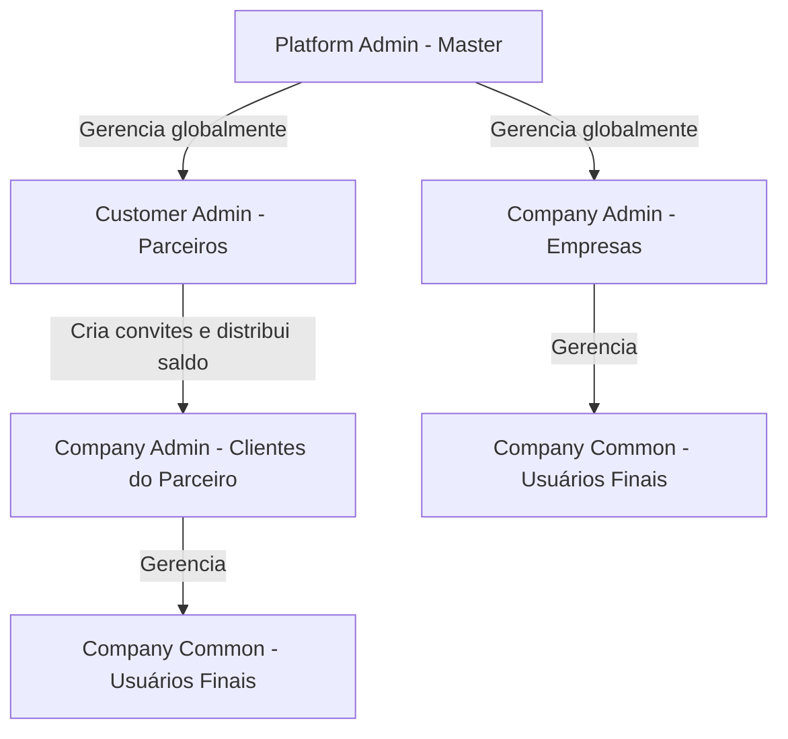
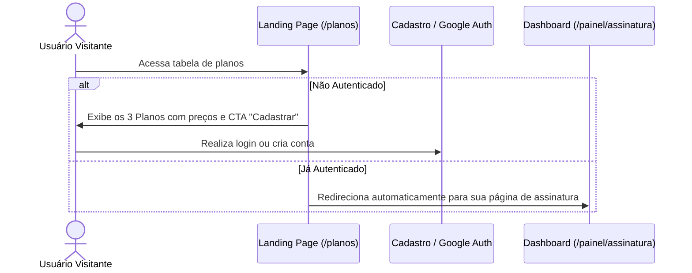

# Documentação de Planos, Acessos e Assinaturas — Consultas PRO

Esta documentação descreve de forma estruturada as regras de negócio, limites operacionais, arquitetura técnica e níveis de permissão que regem o ecossistema de planos, saldos e assinaturas do **Consultas PRO**.

---

## 🔑 Níveis de Acesso e Matriz de Permissões

O Consultas PRO opera com um modelo robusto de controle de acessos (RBAC) projetado para atender desde o administrador geral da plataforma até usuários corporativos e parceiros revendedores.



### 1. Administrador Master (`PLATFORM_ADMIN`)
*   **Identificação padrão**: `admin@consultas.pro` (nível máximo e único por enquanto).
*   **Permissões Core**:
    *   Acesso irrestrito a rota `/admin` e todas as configurações globais do sistema.
    *   Gerenciamento global do saldo de todos os usuários e empresas da plataforma.
    *   Acesso ao painel centralizado de gestão de planos (`/admin?aba=plans-management`).
    *   Visualização de todos os templates de relatórios criados no sistema, com uma aba exclusiva (**"Templates por Conta"**) onde os templates de parceiros e clientes aparecem organizados por empresa/conta de forma colapsável, garantindo que não se misturem com os templates padrão globais.

### 2. Administrador Parceiro (`CUSTOMER_ADMIN`)
*   **Perfil de uso**: Parceiros de negócios e afiliados que fazem gestão de suas próprias carteiras de clientes corporativos (White Label).
*   **Permissões Core**:
    *   **Gestão de Saldo**: Pode remanejar e gerenciar o saldo de todas as contas vinculadas (criadas via convite dele ou vindas de seu link de afiliado), limitando-se estritamente ao saldo disponível em sua própria carteira.
    *   **Gestão de Usuários**: Pode criar convites e cadastrar acessos de nível `COMPANY_ADMIN` (para donos de empresas clientes) e `COMPANY_COMMON` (usuários finais).
    *   **Gestão de Templates**: Tem acesso total ao editor (`/admin/templates-drawer`) e integrações (`/admin/integracoes`). No entanto, ele **nunca edita templates globais do Master diretamente**. Se ele quiser usar um padrão, ele duplica o template global (gerando uma cópia privada sob sua titularidade) e customiza o layout ou a logo para o seu cliente final.

### 3. Administrador de Empresa (`COMPANY_ADMIN` ou `COMPANY_MANAGER`)
*   **Perfil de uso**: Dono ou gestor de uma empresa cliente direta do Consultas PRO ou vinculada a um parceiro.
*   **Permissões Core**:
    *   Gerenciamento de usuários finais dentro da sua empresa.
    *   Vínculo de identidade visual própria (Logo e cores) para os relatórios em formato PDF (White Label básico no plano Company).
    *   Acompanhamento de consumo e extrato financeiro da empresa.

### 4. Usuário Comum (`COMPANY_COMMON` ou `USER`)
*   **Perfil de uso**: Operador de ponta que realiza as consultas no dia a dia.
*   **Permissões Core**:
    *   Nível de acesso mais baixo.
    *   Sem direitos de White Label ou configurações.
    *   Pode efetuar consultas utilizando os templates disponibilizados pela empresa ou pelo parceiro que o gerencia.

---

## 💳 Modelo de Planos e Cobrança

O Consultas PRO oferece 3 modalidades de planos projetadas para se adequar ao tamanho de cada operação, combinando assinaturas recorrentes baseadas em assentos e consumo sob demanda (pay-as-you-go) de créditos para consultas.

| Característica | Plano Grátis | Plano Company | Plano Enterprise (Parceiro) |
| :--- | :---: | :---: | :---: |
| **Valor Mensal** | R$ 0,00 | **R$ 599,90** | **Sob Consulta** (Orçamento sob medida) |
| **Limite de Usuários** | Individual (1) | Até **500 usuários** inclusos | Customizado / Sem limites rígidos |
| **Excedente por Usuário**| N/A | **R$ 99,90** a cada 100 usuários adicionais | Negociável contratualmente |
| **White Label** | Não | Básico (Logo personalizada) | Avançado (Domínio próprio + Customização total) |
| **Gestão de Saldo** | Não | Não | **Sim** (Distribuição de créditos a subcontas) |
| **Acesso a API** | Não | Sim | Sim |

### Regras Especiais de Faturamento (Plano Company)
> [!IMPORTANT]
> O faturamento do plano Company monitora dinamicamente a contagem de usuários cadastrados na empresa (`Company`).
> - O valor fixo de **R$ 599,90** cobre até **500 usuários ativos**.
> - Se a contagem ultrapassar 500, a cobrança calcula automaticamente faixas adicionais de **R$ 99,90** a cada bloco de **100 usuários** adicionais.
>   * *Exemplo 1*: 550 usuários ativos = R$ 599,90 + R$ 99,90 = R$ 699,80/mês.
>   * *Exemplo 2*: 601 usuários ativos = R$ 599,90 + (2 * R$ 99,90) = R$ 799,70/mês.

---

## 🔄 Fluxos de Login, Cadastro e Landing Page

Para facilitar a adesão, o sistema conta com roteamentos dinâmicos inteligentes baseados no estado de autenticação do usuário.



### 🔐 Integração com Google Auth
*   **Vínculo e Login**: Novos usuários podem se cadastrar diretamente utilizando a conta Google.
*   **Vínculo de Contas Existentes**: Se um usuário já possui uma conta criada via e-mail/senha tradicional, ele pode acessar a página `/painel/perfil` e vincular sua conta Google para futuros logins rápidos com um clique.

---

## 🛠️ Arquitetura de Templates e Isolamento por Conta

A duplicação e criação de templates possui um isolamento estrito no banco de dados para evitar que templates criados por parceiros para fins específicos apareçam misturados no fluxo dos demais usuários ou no painel de administração global do Master de forma desorganizada.

### Lógica de Duplicação e Salvamento
Quando o `CUSTOMER_ADMIN` duplica um template padrão do sistema para customizar:
1. Uma cópia física do template é criada na tabela `Template` do banco de dados Prisma.
2. O campo `userId` é preenchido com o ID do parceiro (`CUSTOMER_ADMIN`), e o campo `companyId` é preenchido com a empresa do parceiro.
3. O template é marcado com a visibilidade `PRIVATE` ou `COMPANY`.
4. **Agrupamento no Frontend do Master**: Na página de emissão do Administrador Master (`NewConsultationPage.tsx`), esses templates **não aparecem** nas abas "Templates Padrão" nem em "Templates Personalizados" (do próprio admin). Eles são filtrados reativamente e renderizados exclusivamente na aba **"Templates por Conta"**.
5. **Apresentação Premium**: Na aba "Templates por Conta", os templates são agrupados dinamicamente em cartões sanfonados (colapsáveis) identificados pelo Nome da Empresa ou do Parceiro que o criou, mantendo a visualização de sistema totalmente limpa e profissional.

---

## 🔬 Verificação Técnica de Configurações

### Consulta Rápida das Tabelas do Prisma envolvidas:
```prisma
model Template {
  id            String             @id @default(cuid())
  companyId     String?
  userId        String?
  name          String
  description   String?
  visibility    TemplateVisibility @default(PRIVATE)
  isFavorite    Boolean            @default(false)
  createdAt     DateTime           @default(now())
  updatedAt     DateTime           @updatedAt
  layout        Json?
  logo          String?
  company       Company?           @relation(fields: [companyId], references: [id])
  user          User?              @relation(fields: [userId], references: [id])
  items         TemplateItem[]
}
```

> [!TIP]
> Se precisar validar ou depurar as regras de precificação ou limites de usuários, consulte a tabela `Subscription` associada a cada `Company`. O saldo disponível para as consultas é descontado da tabela `Wallet` correspondente.
