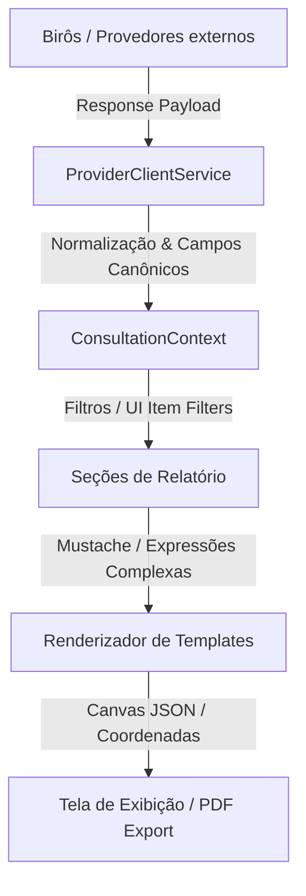

# 🎨 Playbook de Gestão de Templates, Layouts e Integrações (Consultas PRO)

Este guia estabelece os padrões de arquitetura, mapeamentos físicos e lógicos, engenharia de renderização de expressões condicionais e o processo de conversão de mockups/imagens/PDFs para o formato de Canvas do **Consultas PRO**. Ele foi desenhado para servir de instrução definitiva para desenvolvedores e agentes de Inteligência Artificial operarem com máxima precisão no sistema.

---

## 🏛️ 1. Visão Geral da Arquitetura de Apresentação

O Consultas PRO utiliza um sistema de renderização baseado em **Canvas Dinâmico**. Ao contrário de relatórios gerados via HTML/CSS bruto que quebram layouts e paginação, o sistema utiliza coordenadas fixas `(x, y, width, height)` e paginação estruturada em **Frames** no formato A4, permitindo renderizar layouts extremamente ricos de alta fidelidade visual (com direito a grafismos, velocímetros SVG, micro-interações e cartões responsivos) que são exportados idênticos para impressão ou PDF.



---

## 💾 2. Modelagem de Dados (Prisma DB Schema)

O gerenciamento de relatórios e integrações é controlado por relacionamentos precisos entre os seguintes modelos do banco de dados:

### 2.1. O Modelo `Template`
Armazena a folha de desenho (canvas) e todos os elementos de posicionamento.
* **`id`**: Identificador único (`cuid()`).
* **`layout`**: Campo do tipo `Json` contendo a especificação do grid, frames de página e o array de `elements`.
* **`logo`**: Imagem padrão de cabeçalho.

### 2.2. O Modelo `TemplateItem`
Faz o acoplamento físico entre um `Template` e os produtos de provedor (`ProviderProduct`) que alimentam esse template com dados.
* **`alias`**: Nome de escopo lógico no contexto JSON da consulta (ex: `Bacen`, `Spc`, `SerasaPremium`), de forma que as variáveis no layout possam ser acessadas via `{{Bacen.valorTotal}}`.

### 2.3. O Modelo `ProviderProduct`
Controla a integração física de requisição.
* **`bodyTemplate`**: Payload JSON parametrizado enviado ao provedor. Deve conter tags dinâmicas como `{{document}}` nos campos apropriados (como `CPFCNPJ` ou `document`).
* **`typeItemFilters`**: JSON de regras de agrupamento de dados no relatório (mapeando quais trechos da resposta bruta alimentam quais tabelas).

### 2.4. Modelos de Campos Canônicos e Pastas
* **`CanonicalFolder`**: Cria as pastas estruturais de renderização rápida na UI (ex: `Dívidas Birôs`, `Pronampe`).
* **`CanonicalFieldCatalog`**: Catálogo unificado de chaves padronizadas (ex: `DADOS_PESSOAIS.NOME`).
* **`CanonicalFieldFolderAssociation`**: Associa os campos canônicos às pastas correspondentes para exibição ordenada na tela do cliente.

---

## 📐 3. Estrutura do Layout Canvas JSON

O campo `layout` do modelo `Template` segue rigidamente a especificação abaixo:

```json
{
  "id": "import_test_1",
  "name": "Import_test_1",
  "canvas": {
    "grid": 10,
    "background": "#f1f5f9"
  },
  "frames": [
    {
      "id": "frame_page_1",
      "name": "Página 1 (Resumo & Score)",
      "x": 10,
      "y": 10,
      "width": 794,
      "height": 1123,
      "preset": "a4-p",
      "background": "#ffffff"
    }
  ],
  "version": 3,
  "elements": [
    {
      "id": "el_logo_p1",
      "frameId": "frame_page_1",
      "type": "image",
      "x": 40,
      "y": 30,
      "width": 150,
      "height": 50,
      "zIndex": 1,
      "data": {
        "src": "{{logoDataUrl}}",
        "fit": "contain"
      },
      "style": {}
    }
  ]
}
```

### 3.1. Tipos de Elementos Disponíveis no Canvas
1. **`text`**: Renderiza textos simples ou blocos de Rich HTML (quando prefixados com `html:<div...`). Suporta tags Handlebars e expressões condicionais.
2. **`image`**: Exibe imagens estáticas ou dinâmicas (`base64` ou URLs).
3. **`icon`**: Renderiza ícones vetoriais da biblioteca Lucide (ex: `User`, `TrendingUp`, `Compass`, `Activity`, `CheckCircle2`, `FileText`).
4. **`divider`**: Cria separadores de conteúdo estilizados.
5. **`container`**: Blocos estruturais de background com suporte a bordas arredondadas e cores tailwind/HSL para agrupar elementos (cards).
6. **`table`**: Tabelas dinâmicas que iteram sobre arrays de retorno de birôs (ex: lista de cheques devolvidos ou protestos).

---

## 🧠 4. Interpretador Lógico e Sintaxe de Expressões

O interpretador do backend (`renderTemplateObject`) estende os recursos de renderização para suportar fórmulas de alta complexidade matemática e condicional estruturada.

### 4.1. Sintaxe de Expressões Premium (Novo Interpretador)
Para evitar if-else gigantescos e aninhados que quebram o interpretador de JSON padrão, implementou-se a sintaxe baseada em `VAR` de escopo e condicionais estruturadas `case when`:

* **Atribuição de Variáveis**: `VAR nome_variavel = valor`
* **Condicional Avançada**: `case when expressao_1 then valor_1 when expressao_2 then valor_2 else valor_padrao end`
* **Retorno de Expressão**: `RETURN nome_variavel` ou `RETURN valor`

#### Exemplo Prático (Colorização Dinâmica de Score):
```handlebars
{{VAR score = $SCORE_CREDITO[0].score VAR cor = case when score <= 200 then "#ef4444" when score <= 400 then "#f97316" when score <= 600 then "#eab308" when score <= 800 then "#84cc16" else "#22c55e" end RETURN cor}}
```

#### Exemplo de Velocímetro SVG com Ponteiro Rotativo:
O velocímetro utiliza equações de trigonometria dinâmicas baseadas no ângulo do score:
```svg
<svg viewBox='0 0 200 110'>
  <path d='M 20 90 A 80 80 0 0 1 180 90' fill='none' stroke='#e5e7eb' stroke-width='14' />
  <!-- Arcos com cores de risco -->
  ...
  <!-- Ponteiro calculando posição trigonométrica -->
  <line x1='100' y1='90' x2='{{scorePointer.x}}' y2='{{scorePointer.y}}' stroke='{{scoreBandColor}}' stroke-width='2.5' />
</svg>
```

---

## 🔄 5. Processo de Conversão e Importação de Mockups (Imagem/PDF ➔ Canvas JSON)

No futuro, para automatizar a conversão de layouts estáticos (recebidos do cliente em imagem ou PDF) para o formato JSON nativo do Consultas PRO, a IA ou ferramenta de automação deve seguir o pipeline abaixo:

```
[ Mockup PDF / Imagem ]
          │
          ▼
[ Etapa 1: OCR & Análise de Layout (YOLO / Vision Model) ]
          │
          ├─► Extrai blocos de texto, ícones, logotipos e contêineres
          └─► Obtém Bounding Boxes em pixels [x, y, largura, altura]
          │
          ▼
[ Etapa 2: Normalização de Resolução ]
          │
          ├─► Mapeia dimensões para o grid A4 Retrato (794px x 1123px)
          └─► Projeta coordenadas proporcionais
          │
          ▼
[ Etapa 3: Mapeamento de Variáveis Dinâmicas ]
          │
          ├─► Substitui textos estáticos por tags lógicas (ex: "Nome do Cliente" ➔ {{clientName}})
          └─► Converte tabelas estáticas no elemento nativo "table" do Canvas
          │
          ▼
[ Etapa 4: Geração de Canvas JSON ]
          │
          └─► Cospe o array estruturado de frames e elements
```

### 📝 Algoritmo Recomendado de Mapeamento para IAs Visionárias:
1. **Analise a Página**: Uma página A4 retrato padrão tem proporção `794` de largura por `1123` de altura.
2. **Defina os Margens**: Mantenha margens padrão de `40px` nas laterais para que os elementos não fiquem colados na borda física.
3. **Mapeamento de Cores**: Identifique a paleta de cores dominante da imagem. Converta cores hexadecimais brutas para chaves harmônicas.
4. **Agrupamento de Contêineres**: Sempre que houver cartões ou agrupamento de informações (ex: bloco com dados de endereço), crie primeiro um elemento `type: "container"` para servir de background e insira os elementos de texto e ícone sobre ele com `zIndex` incremental.

---

## 🛠️ 6. Gerenciamento de Integrações e Corpos de Requisição

Ao configurar novos birôs de consulta ou corrigir integrações existentes:

### 6.1. Variáveis Dinâmicas Globais
O backend intercepta as requisições de consulta e injeta no contexto de template as seguintes variáveis padronizadas de documento:
* **`{{document}}`**: Documento limpo (apenas números).
* **`{{documento}}`**: Sinônimo de `document`.
* **`{{is_cpf}}`**: Retorna `true` se o documento for CPF (comprimento <= 11) ou do tipo CPF.
* **`{{is_cnpj}}`**: Retorna `true` se o documento for CNPJ (comprimento > 11).

### 6.2. Regra de Ouro para `bodyTemplate`
O corpo da requisição de produtos de integração deve manter **toda a estrutura estática exigida pelo birô**, substituindo dinamicamente apenas a chave de documento.

* ❌ **Errado** (Simplificação incorreta):
  ```json
  { "document": "{{document}}" } // Isso destrói credenciais e chaves específicas de outros provedores!
  ```
*  **Correto** (Payload preservado com campo de documento dinâmico):
  ```json
  {
    "Info": {
      "Solicitante": "IDENTIFICAÇÃO OPCIONAL"
    },
    "Versao": "20180521",
    "Parametros": {
      "CPFCNPJ": "{{document}}",
      "TipoPessoa": "F"
    },
    "ChaveAcesso": "TOKEN_ESTATICO_DE_AUTORIZACAO",
    "CodigoProduto": "1079"
  }
  ```

---

## 🛑 7. Troubleshooting e Resolução de Problemas Comuns

### 7.1. Banco de Dados com Drift ou Resets Acidentais
Se um comando `prisma migrate reset` for executado acidentalmente e limpar as tabelas remotas:
1. **Reconstrua o Schema de Produção**:
   ```bash
   npx prisma migrate deploy
   ```
2. **Suba o Backup Físico Bruto**: Use o utilitário temporário `pg_restore` do docker com `--data-only` e `--disable-triggers` apontado para o banco de produção para restabelecer os templates históricos, contas e logs antigos.
3. **Rode as Sementes Modernas**: Execute os scripts de sementes isolados para não conflitar com dados recuperados:
   ```bash
   npx ts-node prisma/seed-folders.ts
   npx ts-node prisma/seed-brasil-cred.ts
   npx ts-node prisma/seed-new-admins.ts
   ```
4. **Aplique o Patch de Layouts/Expressões Premium**:
   ```bash
   npx ts-node prisma/update-premium-templates.ts
   ```

### 7.2. Erro de Truncamento em Logs de Terminal
Ao listar o layout do template no console usando scripts Node, as saídas gigantes de JSON podem ser truncadas pelo terminal. Use sempre scripts focados ou escreva saídas extensas para arquivos de buffer temporários usando `fs.writeFileSync`.
